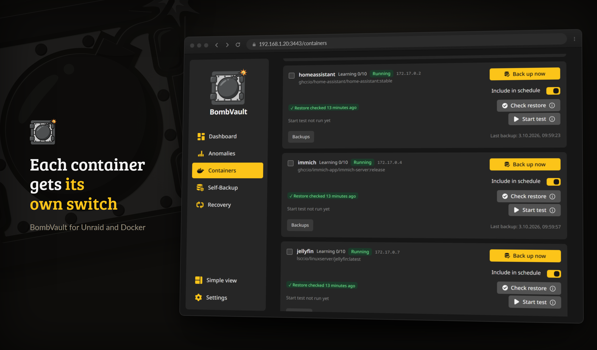
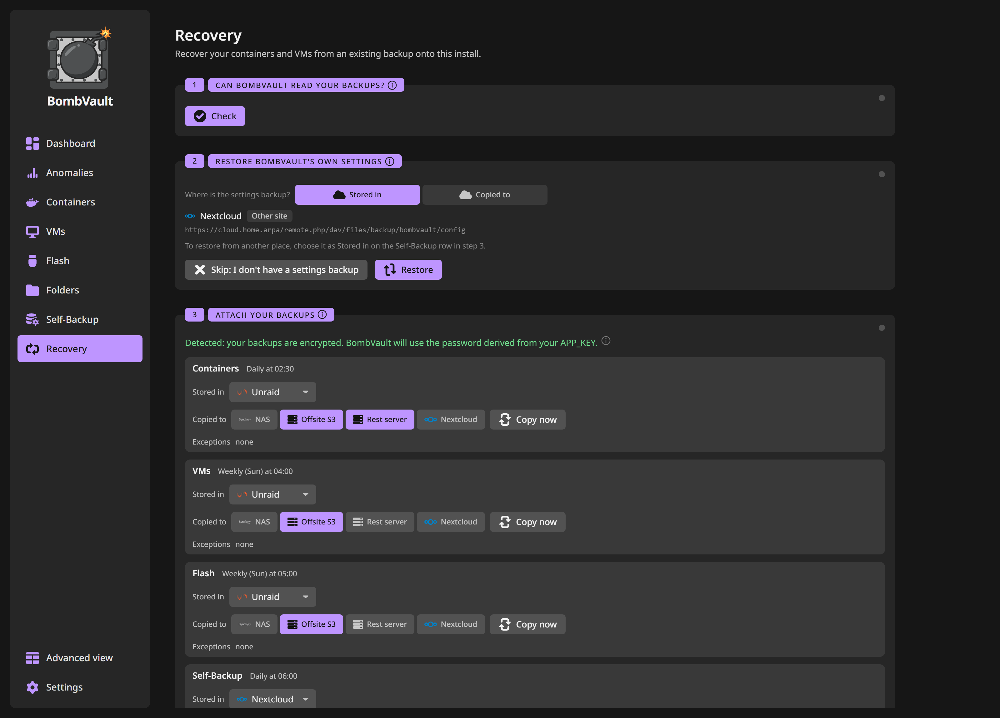

# Functies

BombVault is standaard simpel en diepgaand wanneer je het nodig hebt. De interface toont alleen de essentie totdat je de schakelaar **Eenvoudige weergave / Geavanceerde weergave** omzet. Deze pagina groepeert de volledige functieset.

## Back-upbereik

*Containers, elk met een eigen planningsschakelaar, back-upvolgorde en eigen geschiedenis.*

| Wat | Wat wordt opgeslagen |
|---|---|
| **Docker-containers** | Appdata-map plus de containerdefinitie (image, env-variabelen, poorten, labels, volumes). |
| **KVM / libvirt-VM's** | VM-schijfimage(s), XML-definitie en UEFI NVRAM (nette afsluiting of live snapshot, via SSH). Live snapshots vallen automatisch terug op een nette back-up als de snapshot niet kan worden gemaakt, zodat een VM-back-up nooit zomaar een fout geeft. Met *Alleen gewijzigde blokken* aan wordt een draaiende VM met qcow2-schijven via libvirt-checkpoints gelezen, zodat een back-up alleen de blokken leest die sinds de vorige zijn geschreven, en elke snapshot herstelt nog steeds zelfstandig de hele schijf. |
| **Unraid-flash** | De hele USB-flash (`/boot`): OS, licentie, array-configuratie, shares, netwerk- en plugin-configuratie. Herstel is een `.zip`-download met één klik en overschrijft nooit de live flash. |
| **App-configuratie** | BombVaults eigen `/config` (instellingendatabase, off-site inloggegevens, libvirt SSH-sleutelpaar), gesnapshot met SQLite `VACUUM INTO` zodat een WAL-mode-database nooit halverwege een schrijfactie wordt vastgelegd. Hersteld via een self-restart, zodat de live database nooit onder een open handle wordt overschreven. |
| **Bestanden en mappen** | Benoemde **bestandssets**: elke map op de server (een share, je documenten, een fotobibliotheek), elk met optionele exclude-patronen per set. Volledige gelijkheid met de andere domeinen (planningen, retentie, off-site kopie, integriteitscontroles en hersteloefeningen). |
| **ZFS-datasets** | Een dataset samen met alle datasets eronder, gelezen uit één ZFS-snapshot zodat ze allemaal van hetzelfde moment zijn, en met restic opgeslagen als een map: gededupliceerd, doorzoekbaar, losse bestanden te herstellen. Nieuwe onderliggende datasets komen er vanzelf bij, afzonderlijke kun je uitsluiten, en een dataset die niet te lezen is wordt overgeslagen en bij naam genoemd. Desgewenst worden containers alleen voor het moment van de snapshot gestopt of draait er een opdracht. Volumes horen er niet bij: het volume van een VM wordt met die VM geback-upt, een volume zonder VM wordt nog niet geback-upt. Zie [ZFS-datasets](zfs-datasets.md). |

## Herstel

*Het begeleide herstel loodst een verse installatie op één plek door het rampscenario.*

- **Volledig herstel met één klik.** Kies een snapshot, klik op Herstellen. Klaar.
- **Herstellen vanaf lokaal of off-site.** Elke back-upbrowser heeft een schakelaar **Lokaal / Off-site**, zodat je bij een verloren of corrupte lokale repo direct vanaf de off-site replica kunt lijsten en herstellen. Verwijderen gaat per bron: een back-up verwijderen raakt alleen de kopie die je bekijkt.
- **Containers worden automatisch opnieuw geïnstalleerd.** De containerdefinitie wordt opnieuw afgespeeld tegen de Docker API, zodat de container weer precies zo in het Unraid Docker-tabblad verschijnt als hij was.
- **VM's worden automatisch opnieuw aangemaakt.** De XML wordt via SSH opnieuw geïmporteerd zodat de VM weer in de VM Manager verschijnt met zijn schijf en UEFI NVRAM opnieuw gekoppeld, zelfs nadat de VM was verwijderd. **Back-ups ontdekken** herbouwt een item dat helemaal weg is (bijvoorbeeld na een verse installatie).
- **Individueel herstel.** Herstel één container, één VM of één bestandsset zonder de andere aan te raken.
- **Flash-herstel is een `.zip`-download.** Het streamt naar je browser als `flash-<id>.zip`, klaar om in de Unraid USB-creator te droppen. De live `/boot` wordt nooit aangeraakt.
- **Eén plug-in tegelijk.** De Flash-pagina toont de plug-ins van elke flash-back-up met versie en grootte, en zet één plug-in terug op de draaiende flash: het `.plg`-bestand, de map onder `config/plugins` en de pakketbestanden die de back-up bevat. Verder verandert er niets op de flash. Unraid installeert de plug-in bij de volgende start, of meteen via **Plugins, Install Plugin**.
- **Geplande flash-zip-export.** Schrijf na elke flash-back-up optioneel de snapshot weg als een gewone `.zip` naar een map die je kiest (een enkele overschreven `flash-latest.zip` of een roulerende historie). Richt hem op een Syncthing- of rclone-map zodat je opstartbare-USB-back-up automatisch de server verlaat.
- **Pre-flight conflictcontrole.** Voordat er iets wordt gestopt of verwijderd, verifieert herstel dat het statische IP en de gepubliceerde hostpoorten van de container vrij zijn, en breekt af met een duidelijke melding in plaats van een half afgemaakt herstel achter te laten.
- **Controles voor het herstel.** Elk herstelvenster controleert eerst of de repository antwoordt, of de opgeslagen sleutel hem opent, of het herstelpunt er is en of het doel ruimte heeft voor wat het herstel schrijft. Starten blijft vergrendeld zolang een controle faalt, en de (i) in de knop zegt welke.
- **Herstelplan.** Voor je bevestigt, toont het venster wat het herstel doet vergeleken met wat er nu staat: nieuwe, vervangen en ongewijzigde bestanden, met de lijst op verzoek, en de bestanden op het doel die niet in de back-up staan en blijven waar ze zijn. Bij containers en VM's vergelijkt het ook de instellingen die het herstel aanmaakt met de draaiende: image en tag, poorten, variabelenamen en volumes, of geheugen, vCPU's, schijven en netwerk. restic rekent dit uit als proefrun op grootte en wijzigingstijd, zonder de bestanden te lezen; een heel grote boom stopt na 30 seconden en meldt dat. Een stack-herstel controleert en plant elk lid en noemt het lid dat het blokkeert.
- **Gedeelde mappen.** Een herstel op de oorspronkelijke plek noemt elke andere container, draaiend of niet, waarvan een koppeling reikt tot in een map waarin het herstel schrijft, bijvoorbeeld "dit pad wordt ook gebruikt door nextcloud-db". Het waarschuwt en blokkeert niet.
- **Herstel op bestandsniveau.** Klap de **Bestanden** van een containersnapshot uit, filter, vink een willekeurig aantal bestanden en mappen aan en herstel de selectie ter plaatse of in een map die je kiest.
- **Herstel van bestandsset.** Herstel een bestandsset-snapshot ter plaatse (na een expliciete bevestiging) of in een map die je kiest, nooit stilzwijgend. Selectief herstel werkt hier ook.
- **ZFS-dataset herstellen.** Herstel één dataset van een item op zijn plek (na een ZFS-veiligheidssnapshot die blijft tot je hem verwijdert), in een map of alleen de bestanden die je kiest, of alle datasets van een back-up in een map. Een dataset wordt nooit teruggerold of vervangen.
- **Herstel behoudt de draaistatus.** Een container of VM die draaide toen hij werd geback-upt komt draaiend terug; een die gestopt was blijft gestopt. Vink **Gestopt laten na herstel** aan om opnieuw aan te maken zonder te starten.
- **Herstel een hele stack.** Containers uit hetzelfde Docker Compose-project worden gegroepeerd in een paneel **Stacks**. **Stack herstellen…** herbouwt elk lid vanuit zijn nieuwste back-up (gestopt gelaten) en start ze daarna optioneel in `depends_on`-volgorde.
- **Live voortgang, annuleren en bezig-feedback.** Een lang herstel toont een live percentagebalk en kan worden geannuleerd met een typebewuste bevestiging. Een geannuleerd herstel wordt geregistreerd als *geannuleerd*, niet als mislukt.
- **Begeleid herstel.** Een speciaal tabblad **Herstel** leidt een verse installatie door het noodgeval. Zie [Off-site en herstel](offsite-recovery.md).
- **Herstellen vanuit een andere BombVault-repo.** Een eenmalige, alleen-lezen sessie opent de repo van een andere BombVault-instantie met de `APP_KEY` van die instantie, zodat je een container van server A naar server B kunt halen zonder je eigen instellingen aan te raken. Zie [Off-site en herstel](offsite-recovery.md).
- **ZFS-eigenschappen komen terug.** Elke ZFS-back-up bewaart de lokaal ingestelde eigenschappen van elke dataset, zoals compressie, recordgrootte, quota en hoofdlettergevoeligheid. Terugzetten in een nieuwe dataset maakt die ermee aan, terugzetten in een bestaande dataset toont ze en stelt ze alleen in als je dat vraagt. Zie [ZFS-datasets](zfs-datasets.md#new-dataset).
- **Importeren uit de Appdata.Backup-plug-in.** Wijs BombVault op de pagina **Herstel** de back-upmap van de plug-in aan. Elk containerarchief wordt een herstelpunt van zijn container, gedateerd op het moment dat de plug-in het maakte. Eerder geïmporteerde archieven worden overgeslagen, en de archieven zelf worden alleen gelezen. De container heeft eerst één back-up in BombVault nodig, zodat het herstel zijn definitie heeft.

## Opslag en planning

- Incrementele, gededupliceerde back-ups via restic, zodat zelfs grote VM-schijven de repo niet doen opzwellen.
- **Bestemmingen:** een lokaal pad, of off-site. SMB-shares en WebDAV-servers (Nextcloud, ownCloud, SharePoint) rechtstreeks via een formulier onder Instellingen, Cloudtoegang, rclone, zonder host-mount; NFS (mount de export op Unraid en wijs er een back-uppad naar); native restic-backends zonder rclone (`s3:...`, `rest:http://host:8000/repo`, `b2:...`, `sftp:user@host:/repo`), of elke rclone-remote via `rclone:<remote>:<bucket>/path`. Alle inloggegevens worden versleuteld opgeslagen.
- **SSH-doelen hebben niets geïnstalleerd nodig aan de andere kant.** `sftp:` vereist alleen een SSH-server, dus een kale Raspberry Pi (geen Docker, geen restic) werkt als off-site bestemming. Host keys worden bij het eerste contact automatisch vastgepind.
- **Off-site kopie (lokaal + remote).** Houd de snelle lokale back-up en voeg een of meer off-site replica's toe, gerepliceerd met `restic copy` op best-effort-basis (een off-site hapering laat de lokale back-up nooit mislukken). Elk domein heeft zijn eigen off-site planning, plus een knop **Nu repliceren**.
- **Meerdere off-site doelen per domein.** Elk domein (containers, VM's, flash, config, bestandssets en ZFS-datasets) kan tegelijk naar meerdere off-site bestemmingen repliceren, niet slechts één. Voeg extra doelen toe op de pagina Off-site, elk met zijn eigen repository, S3-opslagklasse, append-only-vlag, retentie en groeibudget. Je bestaande off-site kopie wordt overgenomen als het eerste doel, zodat er niets verandert totdat je een tweede toevoegt, en elk doel van een domein repliceert op de off-site planning van dat domein.
- **Handmatige back-upvolgorde.** Stel de exacte volgorde in waarin je containers worden geback-upt vanuit het paneel back-upvolgorde op de Containers-pagina. Geplande en meervoudige selecties volgen die; elke container die je ongeordend laat houdt het vorige gedrag (meest-achterstallige eerst), en een enkele container-back-up is ongewijzigd.
- **Instelbare retentie:** keep-last / dagelijks / wekelijks / maandelijks / jaarlijks, automatisch geprund na elke back-up, ingesteld **per bron** (zowel lokaal als off-site bij Instellingen, Bewaarbeleid, zodat je off-site kopieën langer als archief kunt bewaren).
- **Compressie per repository:** Uit, Automatisch (de standaard van restic) of Maximaal, in te stellen bij Instellingen, Opslag voor elk back-uppad en elke benoemde repository, en bij Instellingen, Off-site voor elke off-site bestemming. Back-ups, off-site kopieën en prunen schrijven ermee, en de herstelkit noemt het, zodat kale restic op dezelfde manier kan blijven schrijven.
- Planning per domein (dagelijks / wekelijks inclusief meerdaagse sets / elke-N-dagen / ruwe cron), allemaal op één plek bewerkt bij **Instellingen, Schema's**.
- **Wachten tot de app rustig is.** Een container kan zijn geplande back-up laten wachten zolang zijn app bezig is, hoogstens het aantal uren dat je instelt, en hem starten zodra de app rustig is. Een mediaserver is rustig als hij niet streamt, elke andere container als CPU en verkeer een paar minuten onder de grenzen van **Instellingen, Schema's** blijven (op het hostnetwerk telt alleen de CPU). De wachtende back-up staat met reden en uiterste tijd in het activiteitenlogboek en op de container. Hij houdt geen vergrendeling vast, dus de andere containers gaan door. Handmatige back-ups wachten nooit. De leden van een compose-stack die in dezelfde run aan de beurt zijn, wachten samen, en een wachttijd loopt na een herstart met zijn uiterste tijd door. Zet je de containers uit, dan vervallen alle wachtende back-ups, en zet je hun planning uit, dan vervallen de back-ups die de geplande runs hebben tegengehouden. Minder uren verkorten ook een wachttijd die al loopt.
- **Off-site bandbreedtelimieten.** Begrens de restic-upload/downloadsnelheid zodat replicatie je WAN niet verzadigt.
- **Streaming eerst.** Zolang een mediaserver zoals Plex, Jellyfin of Emby streamt, uploaden off-site kopieën met een lagere limiet en keren ze een paar minuten na de stream terug naar de normale. BombVault leest het uitgaande verkeer van de mediaservers uit Docker. REST, S3, B2, Azure, Google Cloud, Swift en rclone via HTTP gaan midden in een kopie trager; SFTP en lokale of gekoppelde mappen krijgen de lagere limiet bij hun volgende kopieerstap. Een mediaserver op het hostnetwerk is niet te meten. Onder **Instellingen, Off-site**.
- **Koude en archiefopslagklasse (S3).** Voor een native S3 off-site repo kun je de opslagklasse kiezen, beperkt tot herstel-leesbare tiers (Standard, Standard-IA, One Zone-IA, Intelligent-Tiering, Glacier Instant Retrieval) zodat archiefprijzen nooit stilzwijgend een herstel breken. De deep-archive-tiers die eerst een asynchrone thaw nodig hebben (Glacier Flexible, Deep Archive) zijn bewust weggelaten. Alleen native S3-backends; rclone-remotes stellen hun klasse in de rclone-config in.
- **Back-upmappen blijven off-box kopieerbaar.** Na elke back-up versoepelt BombVault de lokale repo-boom naar mappen `0755` / bestanden `0644` (repo's zijn versleuteld, dus niets wordt blootgesteld) zodat een niet-root sync-gebruiker via SMB niet buitengesloten raakt. Hersteldefinities leven binnen elke repo, dus een gekopieerde repo-map is volledig zelfstandig.

## Inzicht, verificatie en monitoring

- **Beschermingsstatus (RPO).** Het Dashboard toont een groene / oranje / rode indicator per domein, die de laatste geslaagde back-up vergelijkt met de planning, zodat een achterstallige back-up rood wordt in plaats van weg te schuilen in een log.
- **Back-upgezondheids-heatmap.** Een kalender in de stijl van GitHub-contributies met back-upuitkomsten per dag per domein, met een Containers / VM's / Flash / Zelf-back-up / Mappen-schakelaar.
- **Timing overal.** Elk item in de draaigeschiedenis leest `start, einde (duur)`, en elke container en VM heeft zijn eigen lijst **Recente runs** op zijn pagina.
- **Een dashboard dat je kunt herschikken.** Zet de aanpasmodus aan om kaarten in jouw volgorde te slepen en de kaarten die je niet nodig hebt te verbergen. De indeling wordt per browser opgeslagen.
- **Repositorygrootte en dedup-trend.** Huidige repo-grootte, deduplicatieratio en aantal snapshots per domein, met een sparkline van de opslaggroei.
- **Herstelverificatie-oefeningen.** BombVault bewijst periodiek dat je back-ups herstelbaar zijn (`restic check --read-data-subset`, begrensd) en toont een badge *Herstelbaarheid geverifieerd* per domein.
- **Herstelcontrole na de eerste back-up.** Zodra de eerste back-up van een item klaar is, zet BombVault een steekproef ervan (tot 100 bestanden en 256 MiB) terug in een tijdelijke map onder de herstelmap, laat restic elk bestand terug lezen tegen zijn hashes en vergelijkt de groottes met de back-up. Van een bestand dat te groot is voor de steekproef, zoals een VM-schijf, worden in plaats daarvan de eerste 64 MiB teruggelezen. De kaart van het item toont het resultaat, een fout komt als melding binnen en **Herstel controleren** voert dezelfde controle op de nieuwste back-up uit wanneer je wilt. Latere back-ups herhalen hem niet.
- **Starttest.** Kloppende bytes bewijzen niet dat de app weer opkomt. **Starttest** op een containerkaart zet de nieuwste back-up terug als geïsoleerde kopie en start die: een naam die met `bombvault-test-` begint, een eigen intern Docker-netwerk zonder gepubliceerde poorten en zonder weg naar het LAN, 1 CPU en 2 GiB geheugen, en de data in een tijdelijke map onder de herstelmap. De test slaagt als de healthcheck van de container gezond meldt, zonder healthcheck als de eerste blootgestelde poort binnen dat netwerk antwoordt, en zonder beide als hij blijft draaien. De originele container wordt nooit gestopt of gewijzigd, en de kopie, het netwerk en de data worden daarna verwijderd, ook als BombVault midden in een test herstart. Containers op het hostnetwerk, geprivilegieerde, met apparaten en containers die een andere container nodig hebben, worden als niet testbaar getoond. Zet **Starttest** aan bij de geplande herstelcontroles om per run één container te testen, de langst niet geteste eerst. Het resultaat staat op de kaart en op het dashboard. De kopie draagt geen enkel label van het origineel en draait zonder de capabilities, beveiligingsopties, sysctls en cgroup parent die het origineel toevoegt. Een container die ze nodig heeft, zakt voor de test, en het resultaat noemt waar de kopie zonder draaide.
- **Zelfhelende operaties.** Een aantoonbaar verweesde restic-lock (achtergelaten door een herstart midden in een operatie) wordt automatisch geforceerd gewist en één keer opnieuw geprobeerd. Retentie is identiteitsstabiel (geprund per item, immuun voor pad- of hostwijzigingen) en een retentiefout stuurt een melding.
- **Waarschuwingen die de mappenscan niet ziet.** De uitsluitingsassistent beantwoordt een vraag over grootte. Sommige van de duurste back-upfouten zijn geen kwestie van grootte, dus hij bevat ook app-specifieke kanttekeningen over hoe een applicatie haar data opslaat. De kanttekening waarvoor hij bestaat: Immich bewaart de albums, gezichten en datums van elke foto in een PostgreSQL-database die in een *aparte* container draait, dus een back-up op bestandsniveau van de Immich-container herstelt de foto's zonder dat alles, en het herstel ziet eruit alsof het gelukt is. De waarschuwing verschijnt of er nu een uitsluiting wordt aangeboden of niet, ook bij een container waarvoor niets is geselecteerd om te scannen, omdat de kanttekening hoe dan ook klopt.
- **Zonder back-up (dekking).** Een Dashboard-kaart die alles op de server noemt wat door geen enkele automatische back-up wordt gedekt, met de reden bij elk: nooit aan BombVault toegevoegd, aanwezig maar niet in de planning opgenomen, eigen planning op uit gezet, of nergens een planning ingeschakeld. De beschermingsindicator erboven beantwoordt een andere vraag, namelijk of de back-ups die *wel* gepland zijn op tijd hebben gedraaid, en de container die nooit iemand heeft ingesteld ziet hij niet: die ontbreekt in elke lijst en elke fout, dus voor hem wordt niets oranje. Containers worden uit de live Docker-lijst gelezen in plaats van uit de eigen rijen van BombVault, want een item zonder rij is precies het item dat genoemd moet worden. Een back-uptype dat je hebt uitgeschakeld, telt helemaal niet mee, omdat dat jouw keuze was.
- **Voorbeeld van de retentie.** Het paneel naast de retentie-instellingen toont wat de volgende run gaat verwijderen, voordat het gebeurt: per repository en per item, met de herstelpunten bij naam. Het neemt geen repository-lock en verandert niets, dus het antwoordt ook terwijl er een back-up draait. Staat retentie uit, dan zegt het dat in plaats van een lege lijst te tonen, een append-only repository wordt als zodanig gemarkeerd (daar draait retentie helemaal nooit), en een repository die niet bereikbaar was, wordt genoemd in plaats van stilletjes te ontbreken. Onder **Instellingen, Bewaarbeleid**, voor zowel het lokale als het off-site beleid, elk met een eigen voorbeeld.
- **Anomalieën.** Elke back-up van een container, een VM, een mappenset, een databasedump, de flashdrive en de zelfback-up wordt vergeleken met de eigen geschiedenis van dat item. De controles kijken naar de nieuwe data van een run, afgezet tegen de grootste gebruikelijke hoeveelheden van recente back-ups en tegen het gebruikelijke tempo per uur; naar een back-up die het grootste deel van de data opnieuw heeft opgeslagen, ook hernoemde en herschreven bestanden; naar de brongrootte en het aantal bestanden dat restic voor elk item en elke dump meldt; naar de back-uptijd van restic zelf; naar reeksen mislukkingen en af en toe mislukte runs; naar herstelcontroles die niet meer slagen; en naar de vrije ruimte van lokale, SFTP- en rclone-repositories, doorgerekend uit de groei van de repository. Een item leert van zijn eerste 10 back-ups, terwijl een bijna lege bron, het herschrijven van de meeste data en mislukkingen vanaf het begin worden gecontroleerd. Bij de update wordt de geschiedenis één keer gelezen uit de snapshotsamenvattingen die restic 0.17 bewaart, zodat een bestaande installatie niet bij nul begint. De gevoeligheid (Streng, Gebalanceerd, Soepel) en de laagste ernst die een melding stuurt stel je globaal in onder **Instellingen, Integriteit** en per item kun je ze aanpassen. Waarschuwingen sluiten zichzelf zodra de oorzaak weg is; kritieke bevindingen over verloren data en een vollopende schijf blijven staan tot je ze bevestigt, en een bevestigde bevinding wordt pas opnieuw gemeld nadat de oorzaak één keer verdwenen is. **Als verwacht markeren** maakt een nieuw niveau na 10 back-ups normaal, maar zet de controle op een bijna lege bron nooit uit, en na een gewijzigde selectie begint de geschiedenis van het item vanzelf opnieuw. Zolang een bron bijna leeg is, sterk gekrompen is of een back-up het grootste deel van de data opnieuw heeft opgeslagen, bewaart de retentie de oude back-ups van dat item tot je de bevinding bevestigt of als verwacht markeert, en de bevinding linkt naar de laatste goede back-up. Er gaat één melding per episode uit, en mislukkingen en herstelcontroles die zelf al melden, worden niet dubbel gemeld. Wat het niet doet: S3-, B2- en REST-repositories hebben geen waarde voor vrije ruimte, op de Unraid-gebruikersshare is de vrije ruimte die van de hele array, en back-ups van vóór restic 0.17 hebben geen groottegeschiedenis. Ook ZFS-items worden gecontroleerd, dataset voor dataset: elke dataset van een boom heeft zijn eigen geschiedenis, een dataset die is leeggemaakt of niet meer kon worden gelezen telt als dataverlies, en alleen de oude back-ups van die dataset blijven bewaard. Hoe een ZFS-item per dataset wordt bewaakt, staat onder [ZFS-datasets](zfs-datasets.md#anomalies), en een assistent kan de openstaande anomalieën lezen via de [MCP-server](mcp.md#tools). Een bevinding over de grootte of het aantal bestanden van een bron wordt gedateerd op de eerste back-up waarin ze opdook, en **Vergelijken met de back-up ervoor** toont de mappen waarin bestanden verdwenen, erbij kwamen of veranderden, met een opmerking als bijna alles in een zoekindex, een cache of miniaturen zit die de app zelf opnieuw opbouwt.
- **Aanbevolen uitsluitingen per app.** Voor bekende images (Plex, Jellyfin, Emby, Sonarr, Radarr, Lidarr, Readarr, Prowlarr, Immich, Nextcloud, PhotoPrism en Tautulli, van linuxserver, hotio, binhex of de officiële uitgever) biedt de Uitsluitingsassistent de mappen aan die de app zelf weer vult: caches, logs, voorbeeldafbeeldingen en posters. Elk item zegt wat het bevat, elk kan uit, en er wordt niets uitgesloten tot je op **Selectie uitsluiten** drukt.
- **Supportpakket.** Een geschoonde ZIP met één klik voor een bugrapport: de controle van de hostintegratie, je configuratie met elk geheim verwijderd, de recente runs, wat er als volgende gepland staat, en het recente log. Er zit ook in hoe de laatste dump van elke database verliep, de ZFS-items met de mounts die de container ziet, de openstaande anomalieën en hoeveel MCP-sleutels er zijn (nooit hun namen). Wachtwoorden, tokens, de rclone-configuratie, inloggegevens voor meldingen en elk wachtwoord dat in een repository-locatie zit, worden allemaal verwijderd, en het pakket zegt dat in zijn eigen manifest, want een supportbestand mag nooit worden aangezien voor een configuratieback-up. Om dezelfde reden als de herstelkit vereist het een inlogwachtwoord. Het log dat erin zit, is de uitvoer van deze container sinds de laatste start; voor een crash die de container heeft herstart, blijft `docker logs` de plek om te kijken.
- **Herstelkit voor de encryptiesleutel.** Download met één klik de hoofdsleutel, het afgeleide restic-wachtwoord en de exacte repo-locaties en commando's, zodat je kunt herstellen zonder een draaiende BombVault. Zie [Off-site en herstel](offsite-recovery.md).
- **Je instellingen exporteren en importeren.** Een kaart *Instellingen exporteren / importeren* op de pagina Instellingen, Systeem schrijft je hele configuratie (domeininstellingen, off-site doelen, planningen, retentie, meldingen) naar een portable JSON-bestand, zodat verhuizen naar een nieuwe machine of een setup klonen niet betekent dat je alles met de hand opnieuw invoert. Je kiest of je de off-site en meldingsinloggegevens meeneemt; met die erbij is het bestand net zo gevoelig als je herstelkit. Import toont een voorbeeld en vraagt om bevestiging, en raakt nooit je back-updata of historie aan.
- **Meldingen.** Webhook (Discord / Slack / Gotify / ntfy), Matrix, Healthchecks.io, e-mail (SMTP), een self-hosted [Apprise API](https://github.com/caronc/apprise-api)-server, en Unraids native meldingssysteem. Beleid per back-up: nooit / bij mislukking / altijd. Een geplande run van veel items kan één samenvatting *N van M geslaagd* sturen. Healthchecks krijgt de volledige levenscyclus (`/start`, dan succes of `/fail`) telkens als er een URL is ingesteld.
- **Prometheus `/metrics`.** Opt-in (standaard uit, optioneel bearer-token) voor Grafana of Uptime Kuma. Toont back-upstatus, groottes en tijdstempels, zonder geheimen of paden in de labels.
- **Grootte per map.** In het onderdeel Back-ups van een container, een VM of een mapset laat *Grootte per map* zien welke mappen en bestanden ruimte innemen in de nieuwste back-up en hoeveel daarvan de laatste back-up nieuw of gewijzigd heeft binnengebracht, één niveau per keer. BombVault leest dat uit de index van de repository zonder de bestanden te lezen, en houdt het na elke back-up bij zodra je het een keer hebt geopend.
- **Waarom een back-up traag was.** Terwijl een back-up loopt, kijkt BombVault hoe druk de CPU, de schijven en het netwerk zijn. Duurt een back-up veel langer dan normaal en zat één ding duidelijk aan zijn grens, dan staat dat bij de run, bijvoorbeeld "Doelschijf disk1 was voor 98% bezet" of "BombVault gebruikte 100% van de CPU-limiet van zijn container". Anders staat er niets.
- **Gewijzigd sinds de laatste back-up.** Een container die sinds zijn laatste back-up opnieuw is gemaakt met een ander image, andere poorten, variabelen of volumes, krijgt een markering naast zijn naam. De (i) ervan somt op wat er veranderd is, variabelen alleen bij naam. Het is alleen een melding en verdwijnt bij de volgende back-up.

## Ransomwarebescherming

- **Onveranderlijk (append-only) off-site.** Vlag een off-site repo als append-only zodat ransomware of een gecompromitteerde host je back-ups niet kan verwijderen of herschrijven. De andere kant (een `restic/rest-server` in `--append-only`-modus) dwingt het af; BombVault verifieert het alleen en toont nooit groen op basis van louter een configuratie-claim.
- **Tamper-test.** BombVault bewijst periodiek de append-only-garantie door daadwerkelijk een verwijdering te proberen tegen de off-site repo (gericht op een niet-bestaand object): geweigerd betekent beschermd, geaccepteerd betekent niet beschermd. Een onduidelijk resultaat draait het opgeslagen oordeel nooit om.
- **Begeleide off-site setup.** Een wizard leidt je van de backendkeuze via een kant-en-klaar rest-server-deploysnippet, een verbindingstest, de onveranderlijk-schakelaar en een retentiestrategie.
- **DR-oefeningen (off-site).** Herstel een echt doel vanuit de off-site repo in een wegwerp-sandbox, verifieer het bestand-voor-bestand en byte-voor-byte, en ruim daarna op. Zie [Off-site en herstel](offsite-recovery.md).
- **Ransomwarebeschermings-scorecard.** Een Dashboard-kaart met een groene / oranje / rode houding per domein en een van datum voorziene checklist; elke rode rij linkt diep door naar de fix. Hij wordt alleen groen op geverifieerde feiten.
- **Groeibudget-alarm.** Voor een onveranderlijke off-site (waar oude snapshots bewust nooit worden geprund) stel je een groottebudget in en krijg je een waarschuwing voordat het uit de hand loopt.
- **Koppelen per zin.** Instanties treden met twaalf woorden tot één groep toe: maak de zin aan op de ene, typ hem in op de volgende. Leden op hetzelfde netwerk praten rechtstreeks met elkaar, de andere via een relay (de project-relay, je eigen, of geen), en elke oproep daartussen is end-to-end versleuteld. De groep draagt de scorecards op de Instanties-pagina, Mesh-off-site-aanbiedingen en wat een ontvanger of ophaalbron nodig heeft, nooit back-updata en nooit de APP_KEY. Zie [Off-site en herstel](offsite-recovery.md#pairing).
- **Ontvanger-dashboard (ontvangende kant).** Zet op de machine die onveranderlijke off-site kopieën van een andere BombVault ontvangt de schakelaar **Ontvanger** aan (Instellingen) om een tabblad **Ontvanger** te onthullen. Registreer een ontvangen repository alleen-lezen (geopend met het restic-wachtwoord van de zendende instantie, dat via de koppelingsgroep binnenkomt) om de snapshotinventaris te zien, gegroepeerd per bron, wanneer elke bron voor het laatst arriveerde, en om een onafhankelijke `restic check` op de ontvangende hardware te draaien. Het waarschuwt je wanneer een bron stopt met verzenden binnen een venster dat je instelt (een dead-man's switch) of wanneer een integriteitscontrole mislukt. Strikt alleen-lezen, dus het schrijft nooit naar de ontvangen repository, en standaard uit. Zie [Off-site en herstel](offsite-recovery.md).
- **Ophalen bij een andere instantie (ophalende kant).** Het spiegelbeeld van off-site replicatie: in plaats van dat deze machine haar snapshots naar buiten duwt, haalt ze die van een ander binnen. Zet de schakelaar **Ophalen** aan (Instellingen) om het tabblad **Ophalen** van de pagina **Instanties** te onthullen, kies de andere instantie uit je koppelingsgroep en haar repository-locatie, en kies dan welk soort back-up erin staat en hoe vaak er wordt opgehaald. Haar restic-wachtwoord komt via de groep, nooit haar APP_KEY. De andere kant stelt verder niets in en hoeft niet te draaien. De bronrepository wordt alleen gelezen: ze wordt geopend om het wachtwoord te controleren, opgesomd en als bron van de kopie genoemd, en nooit geïnitialiseerd, ontgrendeld, geprund of beschreven. Elke kant houdt zijn eigen inloggegevens, en een `rclone:`-bron wordt geweigerd omdat rclone die met de remotes van deze instantie zou bereiken. Zie [Off-site en herstel](offsite-recovery.md).

## Platte exports

- **Container-platte-export.** Een knop **Exporteren (gewone tar)** per container schrijft een bladerbare, toolvrije kopie naast de repo: `<name>.tar.gz` van de back-upmappen plus de Unraid `<name>.xml`-template. Restic blijft de engine; dit is een extra gemakskopie.
- **VM-platte-export.** VM's hebben dezelfde **Exporteren (gewone tar)**: `<name>.tar.gz` van de schijfimage(s) plus `<name>.xml`, herstelbaar met `virsh define` plus de schijf, geen BombVault of restic nodig.
- **Versleutel de platte exports (age).** De exports staan buiten restic, dus ze zijn standaard platte tekst. Zet age-versleuteling aan onder Instellingen en voeg een of meer ontvangers toe (een age-publieke sleutel of een SSH-publieke sleutel). Elke export (container- en VM-`.tar.gz`, hun `.xml`-sidecars en de flash-ZIP) wordt dan verzegeld voor die ontvangers, en je ontsleutelt hem later buiten de machine met de bijbehorende privésleutel. Als veiligheidsregel geldt: met versleuteling aan en geen geldige ontvanger ingesteld, mislukt een export met een duidelijke fout in plaats van ooit platte tekst te schrijven.
- **Ook de herstelkit wordt verzegeld.** Met dezelfde instelling aan wordt de kit gedownload als `bombvault-recovery-kit.md.age`. Hij is ASCII-armored in plaats van binair, dus hij blijft gewone leesbare tekst: je kunt hem nog steeds in een wachtwoordmanager plakken of afdrukken, en daar is de kit voor. Dezelfde veiligheidsregel geldt, dus met versleuteling aan en geen bruikbare ontvanger wordt de download geweigerd in plaats van de hoofdsleutel alsnog onversleuteld af te geven. Eén ding moet je goed doen als je dit aanzet: je hebt je age-privésleutel nodig om de kit te openen, dus bewaar die sleutel ergens waar hij niet van de kit zelf afhangt.

## AI-assistenten (MCP) {#mcp}

BombVault heeft een ingebouwde MCP-server waarmee een assistent zoals Claude Code of Claude Desktop de back-upstatus, de dekking, de runhistorie, herstelpunten en de lopende activiteit kan lezen. Met een sleutel die het toestaat kan de assistent ook een back-up van één item, één domein of alles starten en de back-ups annuleren die hij zelf heeft gestart. Herstellen, verwijderen, prune en instellingen blijven in de webinterface. Elke client krijgt een eigen sleutel onder **Instellingen, Integraties, MCP-server**; een sleutel wordt één keer getoond, alleen als vingerafdruk opgeslagen en kan op elk moment worden hernoemd, vervangen of ingetrokken. Starts zijn per uur en per item begrensd, en een bewaarbeveiliging voorkomt dat back-ups van een assistent je eigen herstelpunten uit een beleid "laatste N bewaren" duwen. Elke run die een assistent start, is gemarkeerd met "via MCP" en de naam van de sleutel. Zie [MCP-server](mcp.md). Databasedumps en [ZFS-datasets](zfs-datasets.md) horen bij de items en herstelpunten die hij leest, en hij kan de anomalieën opvragen die BombVault heeft opgemerkt.

## Overig

- **Veel tegelijk back-uppen.** Selecteer meerdere containers en klik op **Selectie back-uppen**. De batch draait server-side, dus hij gaat door zelfs als je het tabblad sluit of de verbinding verliest. BombVault maakt nooit een back-up van (en stopt dus nooit) zijn eigen container.
- **Snapshotbrowser** met een lijst herstelpunten, verwijderen per snapshot en een inklapbare mappenboom voor herstel op bestandsniveau.
- **Repository-onderhoud per domein:** **Verifiëren** (`restic check`), **Ontgrendelen** (een verouderde lock wissen) en **Prunen** (past het bewaarbeleid op aanvraag toe wanneer er een is ingesteld, anders een gewone ruimte-teruggave).
- **Voortgang bij verifiëren, herstelcontroles en opruimen.** Terwijl een ervan loopt, tonen het activiteitenlogboek en de integriteitskaart hoe ver restic heeft geteld, bijvoorbeeld *12 van 47 packs*, met de resterende tijd van die stap zodra er genoeg is om die te schatten. restic telt hier packs, snapshots en indexbestanden, geen bytes, dus dat is wat de balk toont; vóór de eerste telling loopt hij zonder getal.
- **Automatische databasedumps.** Herkende PostgreSQL-, MySQL- en MariaDB-containers (de officiële images, PostGIS, TimescaleDB, pgvector, pgautoupgrade, de database-images van Immich, linuxserver, yobasystems en jc21 MariaDB, en Oracle's mysql-server) worden voor elke back-up gedumpt, vanuit de draaiende server. Containers die alleen op een database lijken, krijgen dezelfde optie op hun kaart, uitgeschakeld tot jij ervoor kiest. De dump stroomt rechtstreeks de repository in en wordt daar een eigen herstelpunt, naast de bestandsback-up; naar een schijf wordt hij nooit geschreven. De inloggegevens komen uit de variabelen van de container zelf, inclusief `*_FILE`-secrets, en verlaten hem niet. Elke kaart laat zien of de datamap van de database gestopt wordt bewaard, draaiend wordt gekopieerd, of helemaal niet wordt bewaard. Een mislukte dump laat de back-up niet mislukken: hij verschijnt als een mislukte run met zijn reden en een aanwijzing om het te verhelpen, en stuurt een melding. Dumps worden nooit vanzelf teruggezet. Download er een (kaal of gecomprimeerd), bewaar hem in een map, importeer hem met één klik in een vers gestarte database, of haal hem op met de restic-CLI. Uitschakelen kan per container, met het label `bombvault.dbdump=false`, of voor alle containers in Instellingen. De anomaliedetectie let ook op de grootte van elke dump, en een assistent kan de dumps van een container opvragen via de [MCP-server](mcp.md#tools).
- **Pre/post-back-up-hooks per container.** Shell-commando's draaien binnen de container (bijvoorbeeld een cache naar schijf wegschrijven); een falende pre-hook breekt de back-up af. Herkende databases worden automatisch gedumpt en hebben daarvoor geen hook nodig.
- **Andere containers stoppen tijdens de back-up, met een health-gated herstart.** Benoem afhankelijke containers (bijvoorbeeld een database) om te stoppen terwijl deze wordt geback-upt. Daarna brengt BombVault ze terug in hun Compose `depends_on`-volgorde en wacht standaard tot elk healthy meldt (of running, als het geen healthcheck heeft) voordat het de containers start die ervan afhangen, zodat een afhankelijkheid als Pi-hole, een database of een VPN-gateway echt online is voordat de services die het nodig hebben terugkeren, in plaats van dat die een *connection refused* teruggeven. De wachttijd wordt begrensd door een timeout per container (standaard 120 seconden) zodat een trage of nooit-healthy container de run nooit kan laten hangen; zowel de wachttijd als de timeout staan bij Instellingen, Containers (zet de wachttijd uit voor de vorige alles-tegelijk-herstart). Dezelfde geordende, health-gated herstart omhult ook de image-update na de back-up, zodat op een dag waarop een update binnenkomt de afhankelijken worden vastgehouden door het opnieuw aanmaken en pas health-gated worden teruggebracht zodra het klaar is.
- **Exclude-patronen per container.** Lijst subdirectory's op om over te slaan binnen een geback-upt volume, één per regel. Typ de paden zoals je ze binnen de container ziet; een live voorbeeld toont wat elke regel oplevert en waarschuwt wanneer een regel niets zou uitsluiten.
- **Bijwerken na geslaagde back-up (geavanceerd, standaard uit).** Zet dit aan op een container en BombVault haalt de nieuwste image op en maakt hem opnieuw aan, maar alleen wanneer er echt een nieuwere image is, zodat er altijd eerst een vers herstelpunt bestaat. Optionele extra's: een melding per bijgewerkte container en image-opruiming (een basisimage die door andere containers wordt gedeeld wordt nooit verwijderd). Na de update vraagt BombVault Unraid ook om de updatestatus van die ene container opnieuw te controleren, zodat de verouderde *update available*-banner in het Docker-tabblad zichzelf wist in plaats van te blijven hangen (Unraid-updates gaan rechtstreeks via de Docker API, dus zijn gecachte status, en op sommige versies een gecachte digest, zou anders de banner blijven tonen). Het is best-effort, raakt de back-up nooit, staat standaard aan en heeft een schakelaar in Instellingen.
- **Herstellen naar een alternatieve map** voor klonen of inspectie.
- **Snapshot-diff en tags.** Vergelijk twee snapshots om te zien wat er veranderd is, en tag snapshots om ze te filteren.
- **Wat is er nieuw na een update.** Release notes verschijnen één keer per nieuwe versie, geserveerd uit notities die in de binary zijn ingebed, zodat het dialoogvenster offline werkt.
- **HTTPS out of the box** (zelfondertekend, of breng je eigen cert mee achter een reverse proxy).
- **Docker-healthcheck.** De container meldt healthy/unhealthy vanuit zijn eigen `/api/health`, zodat een auto-heal-tool hem kan herstarten als de engine ooit vastloopt.
- **Donkere/lichte UI in 42 talen** met een vlaggenkiezer.
