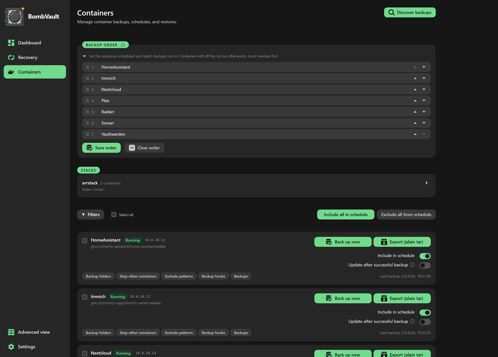
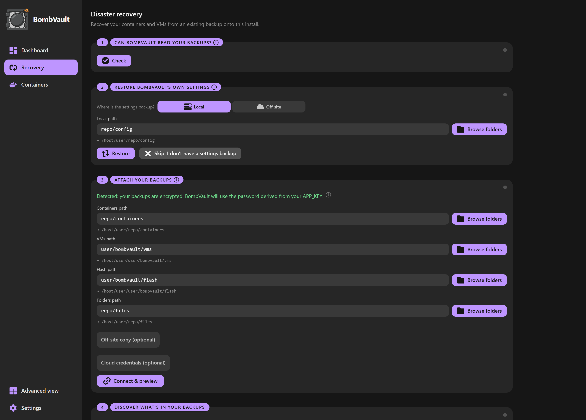

# Funcționalități

BombVault este simplu implicit și profund atunci când ai nevoie. Interfața arată doar elementele esențiale până când comuți switch-ul **Simplu / Avansat**. Această pagină grupează întregul set de funcționalități.

## Sfera backupului

*Containerele, fiecare cu propriul comutator de programare, ordine de copiere și istoric propriu.*

| Ce | Ce se salvează |
|---|---|
| **Containere Docker** | Directorul appdata plus definiția containerului (imagine, variabile de mediu, porturi, etichete, volume). |
| **VM-uri KVM / libvirt** | Imaginea (imaginile) de disc a VM-ului, definiția XML și NVRAM-ul UEFI (oprire controlată sau instantaneu live, prin SSH). Instantaneele live revin automat la un backup controlat dacă instantaneul nu poate fi creat, așa că un backup de VM nu eșuează niciodată pur și simplu. |
| **Flash Unraid** | Întregul flash USB (`/boot`): sistemul de operare, licența, configurația array-ului, partajările, rețeaua și configurația plugin-urilor. Restaurarea este o descărcare `.zip` cu un singur clic și nu suprascrie niciodată flash-ul în execuție. |
| **Configurația aplicației** | Propriul `/config` al BombVault (baza de date de setări, credențialele off-site, perechea de chei SSH pentru libvirt), fotografiat cu SQLite `VACUUM INTO` astfel încât o bază de date în mod WAL să nu fie niciodată capturată în mijlocul unei scrieri. Restaurat printr-o auto-repornire, așa că baza de date în execuție nu este niciodată suprascrisă sub un handle deschis. |
| **Fișiere și foldere** | **Seturi de fișiere** denumite: orice folder de pe server (o partajare, documentele tale, o bibliotecă foto), fiecare cu tipare de excludere opționale per set. Paritate completă cu celelalte domenii (programări, retenție, copie off-site, verificări de integritate și exerciții de restaurare). |

## Restaurare

*Recuperarea ghidată duce o instalare nouă prin cazul de dezastru, într-un singur loc.*

- **Restaurare completă cu un singur clic.** Alege un instantaneu, apasă Restaurare. Gata.
- **Restaurare din local sau off-site.** Fiecare browser de backup are un comutator **Local / Off-site**, așa că dacă un depozit local este pierdut sau corupt poți lista și restaura direct din replica off-site. Ștergerea este per sursă: eliminarea unui backup afectează doar copia pe care o vizualizezi.
- **Containerele sunt reinstalate automat.** Definiția containerului este reaplicată prin API-ul Docker, așa că el reapare în fila Docker din Unraid exact cum era.
- **VM-urile sunt recreate automat.** XML-ul este reimportat prin SSH astfel încât VM-ul reapare în VM Manager cu discul și NVRAM-ul UEFI reatașate, chiar și după ce VM-ul a fost șters. **Discover backups** reconstruiește o intrare care a dispărut complet (de exemplu după o instalare nouă).
- **Restaurare individuală.** Restaurează un container, o VM sau un set de fișiere fără a le atinge pe celelalte.
- **Restaurarea flash este o descărcare `.zip`.** Se transmite către browserul tău ca `flash-<id>.zip`, gata de introdus în creatorul de USB Unraid. `/boot`-ul în execuție nu este atins niciodată.
- **Export ZIP flash programat.** După fiecare backup flash, scrie opțional instantaneul ca un simplu `.zip` într-un folder ales de tine (un singur `flash-latest.zip` suprascris sau un istoric rulant). Îndreaptă-l către un folder Syncthing sau rclone astfel încât backupul tău de USB bootabil să părăsească automat serverul.
- **Verificare de conflicte înainte de zbor.** Înainte ca ceva să fie oprit sau eliminat, restaurarea verifică dacă IP-ul static al containerului și porturile publicate ale gazdei sunt libere și se oprește cu un mesaj clar în loc să lase o restaurare pe jumătate terminată.
- **Restaurare la nivel de fișier.** Extinde **Files** dintr-un instantaneu de container, filtrează, bifează orice număr de fișiere și foldere, apoi restaurează selecția pe loc sau într-un folder ales de tine.
- **Restaurare a unui set de fișiere.** Restaurează un instantaneu de set de fișiere pe loc (după o confirmare explicită) sau într-un folder ales de tine, niciodată în tăcere. Restaurarea selectivă funcționează și aici.
- **Restaurarea păstrează starea de rulare.** Un container sau o VM care rula când a fost salvat revine în execuție; unul care era oprit rămâne oprit. Bifează **Leave stopped after restore** pentru a recrea fără a porni.
- **Restaurare a unui întreg stack.** Containerele din același proiect Docker Compose sunt grupate într-un panou **Stacks**. **Restore stack** reconstruiește fiecare membru din ultimul său backup lăsat oprit, apoi opțional le pornește în ordinea `depends_on`.
- **Progres live, anulare și feedback de ocupare.** O restaurare lungă arată o bară live cu procente și poate fi anulată cu o confirmare conștientă de tip. O restaurare anulată este înregistrată ca *anulată*, nu eșuată.
- **Recuperare ghidată.** O filă dedicată **Recuperare** conduce o instalare nouă prin cazul de dezastru. Vezi [Off-site și recuperare](offsite-recovery.md).
- **Restaurare dintr-un alt depozit BombVault.** O sesiune unică, doar în citire, deschide depozitul unei alte instanțe BombVault cu `APP_KEY`-ul acelei instanțe, astfel încât să poți extrage un container de pe serverul A pe serverul B fără a-ți atinge propriile setări. Vezi [Off-site și recuperare](offsite-recovery.md).

## Stocare și programare

- Backupuri incrementale, deduplicate prin restic, așa că nici măcar discurile mari de VM nu umflă depozitul.
- **Destinații:** o cale locală sau off-site. SMB/CIFS și NFS (montează partajarea pe Unraid și îndreaptă o cale de backup către ea), backenduri restic native fără rclone (`s3:...`, `rest:http://host:8000/repo`, `b2:...`, `sftp:user@host:/repo`) sau orice remote rclone prin `rclone:<remote>:<bucket>/path`. Toate credențialele sunt stocate criptat.
- **Țintele SSH nu necesită nimic instalat pe partea îndepărtată.** `sftp:` necesită doar un server SSH, așa că un simplu Raspberry Pi (fără Docker, fără restic) funcționează ca destinație off-site. Cheile gazdei sunt fixate automat la primul contact.
- **Copie off-site (local + remote).** Păstrează backupul local rapid și adaugă una sau mai multe replici off-site, replicate cu `restic copy` pe bază de best-effort (o problemă off-site nu eșuează niciodată backupul local). Fiecare domeniu are propria programare off-site, plus un buton **Replicate now**.
- **Mai multe ținte off-site per domeniu.** Fiecare domeniu (containere, VM-uri, flash, config și seturi de fișiere) poate replica către mai multe destinații off-site simultan, nu doar una. Adaugă ținte suplimentare în fila Off-site, fiecare cu propriul depozit, clasă de stocare S3, indicator append-only, retenție și buget de creștere. Copia ta off-site existentă este preluată ca prima țintă, așa că nimic nu se schimbă până nu adaugi a doua, iar fiecare țintă a unui domeniu replică conform programării off-site a acelui domeniu.
- **Ordine manuală de backup.** Setează ordinea exactă în care sunt salvate containerele tale din panoul backup-order din pagina Containere. Rulările programate și cele cu selecție multiplă o urmează; orice container lăsat neordonat păstrează comportamentul anterior de tip cel-mai-restant-mai-întâi, iar un backup de un singur container este neschimbat.
- **Retenție configurabilă:** keep-last / zilnic / săptămânal / lunar, curățat automat după fiecare backup, setat **per sursă** (local lângă căile de backup, off-site în fila Off-site astfel încât să poți păstra copiile off-site mai mult timp ca arhivă).
- Programare per domeniu (zilnic / săptămânal, inclusiv seturi de mai multe zile / la fiecare N zile / cron brut), toate editate într-un singur loc în **Setări, Programări**.
- **Limite de lățime de bandă off-site.** Limitează rata de upload/download restic astfel încât replicarea să nu satureze WAN-ul tău.
- **Clasă de stocare la rece și de arhivă (S3).** Pentru un depozit off-site S3 nativ poți alege clasa de stocare, restricționată la niveluri care permit restaurarea (Standard, Standard-IA, One Zone-IA, Intelligent-Tiering, Glacier Instant Retrieval) astfel încât tariful de arhivă să nu strice niciodată o restaurare în tăcere. Nivelurile de arhivă profundă care necesită mai întâi o dezghețare asincronă (Glacier Flexible, Deep Archive) sunt lăsate deoparte intenționat. Doar backenduri S3 native; remote-urile rclone își setează clasa în configurația rclone.
- **Folderele de backup rămân copiabile în afara stației.** După fiecare backup BombVault relaxează arborele depozitului local la directoare `0755` / fișiere `0644` (depozitele sunt criptate, deci nimic nu este expus) astfel încât un utilizator de sincronizare non-root prin SMB să nu fie blocat. Definițiile de recuperare se află în interiorul fiecărui depozit, deci un folder de depozit copiat este complet autonom.

## Perspectivă, verificare și monitorizare

- **Stare de protecție (RPO).** Panoul principal arată un indicator verde / galben / roșu per domeniu, comparând ultimul backup reușit cu programarea sa, astfel încât un backup restant devine roșu în loc să se ascundă într-un jurnal.
- **Heatmap de sănătate a backupului.** Un calendar în stil contribuții-GitHub cu rezultatele backupului per zi și per domeniu, cu un comutator Containere / VM-uri / Flash / Config / Fișiere.
- **Timp de rulare peste tot.** Fiecare intrare din istoricul rulărilor arată `start, sfârșit (durată)`, iar fiecare container și VM poartă propria listă **Rulări recente** pe pagina sa.
- **Un panou pe care îl poți rearanja.** Comută modul de personalizare pentru a trage cardurile în ordinea ta și a le ascunde pe cele de care nu ai nevoie. Aspectul este salvat per browser.
- **Dimensiunea depozitului și tendința de dedup.** Dimensiunea curentă a depozitului, raportul de deduplicare și numărul de instantanee per domeniu, cu un sparkline al creșterii stocării.
- **Exerciții de verificare a restaurării.** BombVault dovedește periodic că backupurile tale pot fi restaurate (`restic check --read-data-subset`, mărginit) și arată o insignă *ultima dată verificat ca restaurabil* per domeniu.
- **Operațiuni cu auto-vindecare.** Un blocaj restic dovedibil orfan (lăsat de o repornire în mijlocul unei operațiuni) este forțat eliberat și reîncercat o dată, automat. Retenția este stabilă ca identitate (curățată per element, imună la schimbări de cale sau gazdă), iar o eșuare de retenție trimite o notificare.
- **Kit de recuperare a cheii de criptare.** Descărcare cu un singur clic a cheii principale, a parolei restic derivate și a locațiilor și comenzilor exacte ale depozitului, astfel încât să poți restaura fără un BombVault în execuție. Vezi [Off-site și recuperare](offsite-recovery.md).
- **Exportă și importă-ți setările.** Un card *Export și import setări* pe pagina Setări scrie întreaga ta configurație (setări de domeniu, ținte off-site, programări, retenție, notificări) într-un fișier JSON portabil, astfel încât mutarea pe o stație nouă sau clonarea unei configurații să nu însemne reintroducerea totul manual. Alegi dacă incluzi credențialele off-site și de notificare; cu ele, fișierul este la fel de sensibil ca kitul tău de recuperare. Importul arată o previzualizare și cere confirmare și nu îți atinge niciodată datele sau istoricul de backup.
- **Notificări.** Webhook (Discord / Slack / Gotify / ntfy), Matrix, Healthchecks.io, e-mail (SMTP), un server [Apprise API](https://github.com/caronc/apprise-api) self-hosted și sistemul nativ de notificări al Unraid. Politică per backup: niciodată / la eșec / întotdeauna. O rulare programată a mai multor elemente poate trimite un singur rezumat *N din M reușite*. Healthchecks primește întregul ciclu de viață (`/start`, apoi succes sau `/fail`) ori de câte ori este setat un URL.
- **Prometheus `/metrics`.** Opțional (implicit oprit, token bearer opțional) pentru Grafana sau Uptime Kuma. Expune starea, dimensiunile și marcajele temporale ale backupurilor, fără secrete sau căi în etichete.

## Protecție împotriva ransomware

- **Off-site imuabil (append-only).** Marchează un depozit off-site ca append-only astfel încât ransomware-ul sau o gazdă compromisă să nu poată șterge sau rescrie backupurile tale. Partea îndepărtată (un `restic/rest-server` în mod `--append-only`) o impune; BombVault doar o verifică și nu arată niciodată verde doar pe baza unei afirmații de configurare.
- **Test de manipulare.** BombVault dovedește periodic garanția append-only încercând efectiv o ștergere împotriva depozitului off-site (îndreptată către un obiect inexistent): refuzată înseamnă protejat, acceptată înseamnă neprotejat. Un rezultat neconcludent nu răstoarnă niciodată verdictul stocat.
- **Configurare off-site ghidată.** Un asistent te conduce de la alegerea backend-ului până la un fragment de deploy rest-server gata de lipit, un test de conexiune, comutatorul de imuabilitate și o strategie de retenție.
- **Exerciții DR (off-site).** Restaurează o țintă reală din depozitul off-site într-un sandbox de unică folosință, verifică-o fișier cu fișier și octet cu octet, apoi curăță. Vezi [Off-site și recuperare](offsite-recovery.md).
- **Fișă de evaluare a protecției împotriva ransomware.** Un card pe panoul principal cu o postură verde / galben / roșu per domeniu și o listă de verificare marcată cu vârsta; fiecare rând roșu are link direct către remediu. Devine verde doar pe fapte verificate.
- **Alarmă de buget de creștere.** Pentru un off-site imuabil (unde instantaneele vechi nu sunt niciodată curățate în mod deliberat), setează un buget de dimensiune și primești o alertă înainte ca acesta să scape de sub control.
- **Panou de recepție (partea de recepție).** Pe stația care primește copii off-site imuabile de la un alt BombVault, activează comutatorul **Receiver** (Setări) pentru a dezvălui o filă **Receiver**. Înregistrează un depozit primit doar în citire (deschis cu cheia instanței care trimite) pentru a vedea inventarul său de instantanee grupat pe sursă, când a sosit ultima dată fiecare sursă și pentru a rula un `restic check` independent pe hardware-ul care primește. Te alertează când o sursă încetează să trimită într-o fereastră pe care o setezi (un comutator de tip dead-man) sau când o verificare de integritate eșuează. Strict doar în citire, deci nu scrie niciodată în depozitul primit, și oprit implicit. Vezi [Off-site și recuperare](offsite-recovery.md).

## Exporturi în clar

- **Export în clar de container.** Un buton **Export** per container scrie o copie navigabilă, fără instrumente, lângă depozit: `<name>.tar.gz` al folderelor de backup plus șablonul Unraid `<name>.xml`. Restic rămâne motorul; aceasta este o copie de comoditate suplimentară.
- **Export în clar de VM.** VM-urile au același **Export (plain tar)**: `<name>.tar.gz` al imaginii (imaginilor) de disc plus `<name>.xml`, restaurabil cu `virsh define` plus discul, fără BombVault sau restic necesare.
- **Criptează exporturile în clar (age).** Exporturile se află în afara restic, deci sunt în clar implicit. Activează criptarea age în Setări și adaugă unul sau mai mulți destinatari (o cheie publică age sau o cheie publică SSH). Fiecare export (container și VM `.tar.gz`, fișierele lor `.xml` însoțitoare și ZIP-ul flash) este apoi sigilat pentru acei destinatari, iar tu îl decriptezi mai târziu în afara stației cu cheia privată corespunzătoare. Ca regulă de siguranță, cu criptarea activată și niciun destinatar valid setat, un export eșuează cu o eroare clară în loc să scrie vreodată text în clar.

## Altele

- **Fă backup la multe simultan.** Selectează multiplu containere și apasă **Back up selected**. Lotul rulează pe partea de server, deci continuă chiar dacă închizi fila sau pierzi conexiunea. BombVault nu face niciodată backup (și deci nu oprește niciodată) propriul său container.
- **Browser de instantanee** cu o listă de puncte de restaurare, ștergere per instantaneu și un arbore de foldere pliabil pentru restaurare la nivel de fișier.
- **Mentenanță a depozitului per domeniu:** **Verify** (`restic check`), **Unlock** (elimină un blocaj rămas) și **Prune** (aplică politica de retenție la cerere când una este setată, altfel o simplă recuperare de spațiu).
- **Hook-uri pre/post-backup per container.** Comenzi shell rulate în interiorul containerului (de exemplu `mysqldump` în appdata înainte de backup); un pre-hook eșuat anulează backupul.
- **Oprește alte containere în timpul backupului, cu o repornire condiționată de sănătate.** Numește containere dependente (de exemplu o bază de date) care să fie oprite în timp ce acesta este salvat. Ulterior BombVault le readuce în ordinea `depends_on` din Compose și, implicit, așteaptă ca fiecare să raporteze că este sănătos (sau în execuție, dacă nu are healthcheck) înainte de a porni containerele care depind de el, astfel încât o dependență precum Pi-hole, o bază de date sau un gateway VPN să fie efectiv activă înainte de serviciile care au nevoie de ea, în loc ca acelea să revină la un *connection refused*. Așteptarea este mărginită de un timeout per container (120 de secunde implicit) astfel încât un container lent sau niciodată sănătos să nu poată bloca niciodată rularea; atât așteptarea cât și timeout-ul se află în Setări, Programări (dezactivează așteptarea pentru repornirea anterioară toate-deodată). Aceeași repornire ordonată, condiționată de sănătate, învelește și actualizarea imaginii de după backup, așa că într-o zi în care sosește o actualizare, dependenții sunt ținuți jos pe durata recreării și readuși, condiționat de sănătate, doar odată ce s-a terminat.
- **Tipare de excludere per container.** Listează subdirectoare de sărit în interiorul unui volum salvat, câte unul pe linie. Scrie căile așa cum le vezi în interiorul containerului; o previzualizare live arată la ce se rezolvă fiecare linie și avertizează când o linie nu ar exclude nimic.
- **Actualizează după un backup reușit (avansat, oprit implicit).** Activează-l pe un container și BombVault descarcă cea mai nouă imagine și îl recreează, dar doar când există efectiv o imagine mai nouă, astfel încât un punct de restaurare proaspăt să existe mereu mai întâi. Extra opționale: o notificare per container actualizat și curățarea imaginilor (o imagine de bază partajată de alte containere nu este niciodată ștearsă). După actualizare BombVault cere de asemenea Unraid să reverifice starea de actualizare a acelui container, astfel încât bannerul învechit *update available* din fila Docker să se șteargă singur în loc să persiste (actualizările Unraid trec direct prin API-ul Docker, deci starea sa în cache, și pe unele versiuni un digest în cache, ar continua altfel să arate bannerul). Este best-effort, nu afectează niciodată backupul, activat implicit și are un comutator în Setări.
- **Restaurare într-un folder alternativ** pentru clonare sau inspecție.
- **Diff și etichete de instantanee.** Compară două instantanee pentru a vedea ce s-a schimbat și etichetează instantaneele pentru a le filtra.
- **Ce este nou după o actualizare.** Notele de lansare apar o dată per versiune nouă, servite din note încorporate în binar, deci dialogul funcționează offline.
- **HTTPS din start** (auto-semnat sau adu-ți propriul certificat în spatele unui reverse proxy).
- **Healthcheck Docker.** Containerul raportează sănătos/nesănătos din propriul `/api/health`, astfel încât un instrument de auto-vindecare îl poate reporni dacă motorul se blochează vreodată.
- **Interfață întunecată/luminoasă în 42 de limbi** cu un selector de steag.
