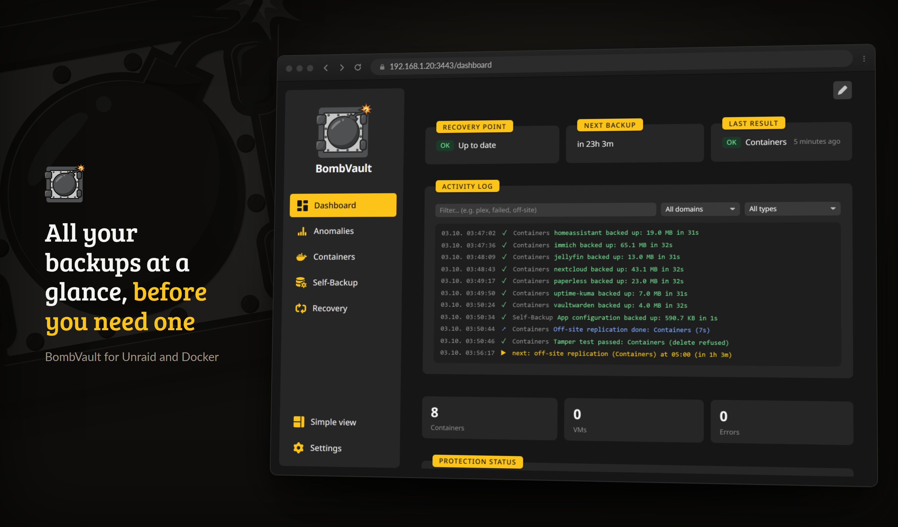
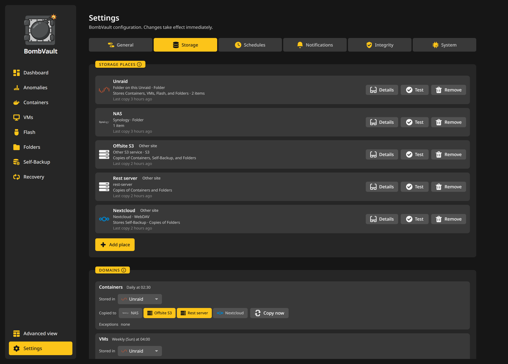

# Aloitus

Tämä sivu opastaa sinut tuoreesta Unraid-laatikosta ensimmäiseen varmuuskopioosi.

## Vaatimukset

| Vaatimus | Huomiot |
|---|---|
| **Unraid 6.12+** | Aiempia versioita ei ole testattu. Unraid on pääalusta, mutta BombVault toimii myös tavallisella Docker-isännällä ja TrueNAS Scalella (katso [Yleinen Docker-isäntä](#generic-docker-host)). |
| **Restic-repon sijainti** | Paikallinen polku (suositus: array tai cache), SMB, NFS tai mikä tahansa rclone-taustajärjestelmä. |
| **Docker-soketti** | Malli liittää automaattisesti (`/var/run/docker.sock`). |
| **Unraid flash** (`/boot`) | Malli liittää kokonaan automaattisesti (`/boot` kohteeseen `/host/boot`). Mahdollistaa flash-varmuuskopioinnin ja sen, että palautettu kontti ilmestyy takaisin normaalina, muokattavana Unraid-sovelluksena. |
| **KVM-virtuaalikoneet** (valinnainen) | VM-varmuuskopiointi keskustelee libvirtin kanssa SSH:n yli, ei libvirt-liitosta. Määritä se Asetuksissa (katso [Asetukset](configuration.md)). |
| **ZFS-tietojoukot** (valinnainen) | Sama SSH-yhteys kuin virtuaalikoneiden varmuuskopioinnissa, `zfs` isännällä ja Host Data liitettynä polkuun `/mnt` käyttötilalla Read/Write - Slave, joka on mallin oletus. Katso [ZFS-tietojoukot](zfs-datasets.md). |
| **Android-sovellus** (valinnainen) | Android 10 tai uudempi, pariliitettynä palvelimiin, joiden versio on 9.7.0 tai uudempi. Katso [Android-sovellus](android.md). |

## Asennus Unraidiin

Helpoin reitti on **Community Applications**.

1. Avaa **Apps**-välilehti Unraidissa.
2. Hae **BombVault**.
3. Napsauta **Install**, aseta vaaditut muuttujat (alla) ja ota käyttöön.

!!! tip "Mallin manuaalinen asennus"
    Jos haluat lisätä mallin käsin:

    1. Mene kohtaan **Docker, Add Container, Template repositories** ja lisää:
       ```
       https://github.com/junkerderprovinz/unraid-apps
       ```
    2. Hae **BombVault** kohdasta Templates.
    3. Aseta vaaditut muuttujat ja napsauta **Apply**.

## Yleinen Docker-isäntä {#generic-docker-host}

Ei Unraidia? BombVault toimii myös tavallisena konttina millä tahansa Docker-isännällä (tämä kannattelee myös TrueNAS Scalen konttituen, ennen kuin sillä on oma merkintänsä sikäläisessä sovelluskatalogissa).

1. Nouda arkistosta valmiiksi muokattava [`deploy/docker-compose.generic.yml`](https://github.com/junkerderprovinz/bombvault/blob/main/deploy/docker-compose.generic.yml).
2. Aseta `APP_KEY` (katso alta) ja osoita Host Data -taltio todelliseen datajuureesi: tiedoston kommentit käyvät läpi molemmat.
3. `docker compose up -d`, avaa sitten `https://<isännän-ip>:3443/`.

Mikä poikkeaa Unraidista:

- **Ei flash/USB-aluetta.** Käynnistys-USB:tä ei ole talteen otettavaksi tai palautettavaksi, joten asetusten Flash-alueella ei ole täällä tehtävää. Sen sijaan Kansiot-alue tarjoaa yhden napsautuksen ehdotuksen **Lisää esiasetus: isäntäjärjestelmän kokoonpano** (aloittava `/etc`-tiedostojoukko, jonka käyt läpi ja muokkaat ennen tallennusta) käytännöllisenä yleisenä vastineena.
- **Ei Unraidin omia ilmoituksia.** BombVaultin omat ilmoituskanavat (webhook, off-site-epäonnistumisen varoitukset ja niin edelleen) toimivat tavalliseen tapaan; pois jää vain Unraid-kohtainen lähetys sen omaan ilmoitusjärjestelmään, koska sellaista järjestelmää ei täällä ole.
- **Virtuaalikoneiden varmuuskopiointi on valinnaista ja vaatii erillisen, SSH:n yli tavoitettavan libvirtd-isännän.** Katso compose-tiedoston kommentoitu lohko. Yleisessä Docker-isännässä ei ole omaa virtuaalikoneiden hallintaa.
- **Ei kojelautawidgetiä.** BombVault Widget on Unraid-laajennus, joten tämäkin vaihe jää pois.
- **Kontin datan löytäminen.** Ilman Unraidin `appdata`-käytäntöä kontin datakansio löydetään `DATA_ROOT_SEGMENTS`-muuttujan segmenttien, Dockerin nimettyjen taltioiden, Compose-projektin työhakemiston ja `bombvault.data`-tunnisteen perusteella (katso [Varmuuskopion lähteiden tunnistus](configuration.md#backup-source-detection)). Nimetyt taltiot ja `/etc`-esiasetus yltävät vain Host Data -liitoksen sisällä oleviin polkuihin, joten osoita Host Data yhteiseen ylähakemistoon, joka kattaa myös Dockerin datajuuren.
- **`PLATFORM`.** Aseta arvoksi `generic` tai `truenas`. Jos sitä ei aseteta, BombVault tunnistaa Unraidin sen omasta merkistä flash-liitoksessa ja käsittelee kaiken muun yleisenä, ja vain Unraidia koskevat vaiheet ohitetaan sen sijaan, että niitä yritettäisiin ja ne epäonnistuisivat.

**TrueNAS Scale** kulkee samaa compose-reittiä; luettelomerkintä on valmisteltu repoon, mutta sitä ei ole vielä lähetetty. Virtuaalikoneiden varmuuskopiointi vaatii siellä `LIBVIRT_URI`-muuttujan, koska TrueNASin libvirtd kuuntelee omaa sokettiaan (`/run/truenas_libvirt/libvirt-sock`), jota kolme `LIBVIRT_*`-muuttujaa eivät pysty ilmaisemaan (katso [Asetukset](configuration.md)). Kuinka pitkälle tämä on todennettu: zvol-varmuuskopio ajettiin oikealla TrueNAS Scale -laitteella zvolille, joka oli liitetty käynnissä olevaan virtuaalikoneeseen, ja `zfs snapshot`, `zfs send`, restic ja `zfs receive` veivät sen edestakaisin tavu tavulta muuttumattomana. Täyttä BombVaultin itsensä ohjaamaa palautusta ei ole vielä ajettu TrueNAS-laitteistolla, ja tuo zvol oli harva (sparse), joten läpäisyä monen gigatavun kokoluokassa ei ole testattu. Testaa palautus siellä ennen kuin luotat siihen.

## Ainoa vaadittu asetus

Ainoa muuttuja, joka sinun on asetettava, on `APP_KEY`, 32-tavuinen heksadesimaalisalaisuus (64 heksamerkkiä), jota käytetään restic-arkiston salasanan johtamiseen.

Luo sellainen millä tahansa koneella:

```bash
openssl rand -hex 32
```

Liitä tulos mallin `APP_KEY`-kenttään (Unraid) tai `docker-compose.yml`-tiedoston `APP_KEY`-ympäristömuuttujaan (tavallinen Docker-isäntä).

!!! danger "Älä menetä APP_KEY:tä"
    `APP_KEY`:n menettäminen tekee salatuista varmuuskopioistasi palautuskelvottomia. Säilytä se turvallisessa paikassa erillään palvelimesta. Kun BombVault on käynnissä, käytä sen yhden napsautuksen **salausavaimen palautuspakettia** (katso [Etäsijainti ja palautus](offsite-recovery.md)) tallentaaksesi koko palautusnipun.

Malli liittää myös Docker-soketin, flashin (`/boot`) ja **Host Data** -juuren (`/mnt`) puolestasi. Varmuuskopioinnin *lähteet* ja *kohteet* asuvat molemmat Host Datan alla. Täydellinen muuttujaviite ja etäsijainnin määritys löytyvät kohdasta [Asetukset](configuration.md).

## Ensimmäinen ajo



*Koontinäyttö ensimmäisen varmuuskopion jälkeen: mikä on suojattu, mikä ajetaan seuraavaksi ja elävä loki.*

1. Avaa verkkokäyttöliittymä osoitteessa `https://<your-unraid-ip>:3443` (itse allekirjoitettu varmenne valmiiksi).
2. Ota **Asetuksissa** käyttöön haluamasi varmuuskopioinnin toimialueet (Kontit, VMs, Flash, Itsevarmuuskopio, Kansiot, ZFS-tietojoukot) ja valitse korostusväri.
3. Valitse **Kontit**-välilehdellä kontti ja napsauta **Varmuuskopioi nyt** tehdäksesi ensimmäisen palautuspisteesi. Repopolut ovat oletuksena `/mnt/user/bombvault/{container,vms,flash,config,files,zfs}` ja ne luodaan ensimmäisen varmuuskopion yhteydessä.
4. Määritä ajastus kohdasta **Asetukset, Aikataulut**. Konteille ja virtuaalikoneille on yhden napsautuksen *Sisällytä kaikki aikatauluun*.

!!! tip "Valinnaista: valitse varmuuskopiojärjestys"
    Jos jotkin kontit tulisi aina varmuuskopioida ennen muita (esimerkiksi tietokanta ennen sitä käyttävää sovellusta), avaa **Varmuuskopioiden järjestys**-paneeli Kontit-sivulla ja vedä ne haluamaasi järjestykseen. Ajoitetut ja monivalinnalla käynnistetyt ajot noudattavat sitä; kaikki järjestämättä jättämäsi varmuuskopioidaan erääntyneimmät ensin, kuten ennenkin.

!!! note "Isäntäintegraation tarkistus"
    Avaa `/spike` verkkokäyttöliittymässä kontin käynnistyttyä. Se koettaa jokaista liitosta ja komentorivityökalua (Docker-soketti, libvirt, restic, qemu-img, rclone) ja raportoi puuttuvat palaset, joten voit vahvistaa, että kontti on kytketty oikein ennen kuin luotat siihen.

## Yksinkertainen vs Edistynyt



*Asetuksissa ei ole Tallenna-painiketta: jokainen muutos kirjoitetaan heti.*

Oletuksena käyttöliittymä näyttää vain olennaiset (varmuuskopiointi, palautus, ajastus). Käytä sivupalkin **Yksinkertainen näkymä / Edistynyt näkymä** -kytkintä paljastaaksesi asiantuntijasäätimet: säilytys, etäkopio, ennen/jälkeen-koukut, tiedostotason palautus, ilmoitukset, Prometheus-mittarit sekä eheys- ja ylläpitotyökalut. Se on selainkohtainen asetus ja oletuksena pois päältä, joten uudet käyttäjät saavat siistin käyttöliittymän ja tehokäyttäjät kaiken.

## Kääntäminen lähdekoodista {#build-from-source}

BombVault on yksi staattinen Go-binääri, joka tarjoaa JSON-rajapinnan ja upotetun React-käyttöliittymän. Käännä ensin käyttöliittymä ja aja sitten binääri:

```bash
npm --prefix web ci
npm --prefix web run build     # writes web/dist, which the binary embeds
export APP_KEY=$(openssl rand -hex 32)
go test ./...                  # unit and integration tests, with a real restic round trip
golangci-lint run ./...
go run ./cmd/bombvault         # serves https://localhost:3443 with a self-signed certificate
```

Käyttöliittymän käännös tarvitaan myös `go run` -komentoa varten. Repo seuraa polussa `web/dist` vain tyhjää merkkitiedostoa, joten ilman komentoa `npm --prefix web run build` binääri ei upota mitään ja vastaa `500 SPA index not found`, mikä on odotettua. Dockeria, libvirtiä ja Unraidia ei voi testata CI:ssä, joten tarkista liitokset, restic ja virtuaalikoneiden SSH-yhteys oikealla isännällä isäntäintegraation tarkistuksella (`/spike`) ennen kuin avaat pull requestin.

## Seuraavat vaiheet

- Selaa täyttä **[Ominaisuudet](features.md)**-listaa.
- Tuo ryhmäsi kaikki palvelimet puhelimeesi **[Android-sovelluksella](android.md)**.
- Lisää yksi tai useampi **[Etäsijainti ja palautus](offsite-recovery.md)** -replika (kukin toimialue voi lähettää useaan kohteeseen kerralla) ja tallenna palautuspakettisi.
- Kloonaatko kokoonpanoa tai siirrytkö uuteen laatikkoon? Kanna koko kokoonpanosi mukanasi **Vie / tuo asetukset** -kortilla. Katso [Asetukset](configuration.md#portable-settings-export-and-import).
- Törmäsitkö esteeseen? Katso **[Vianmääritys](troubleshooting.md)**.
