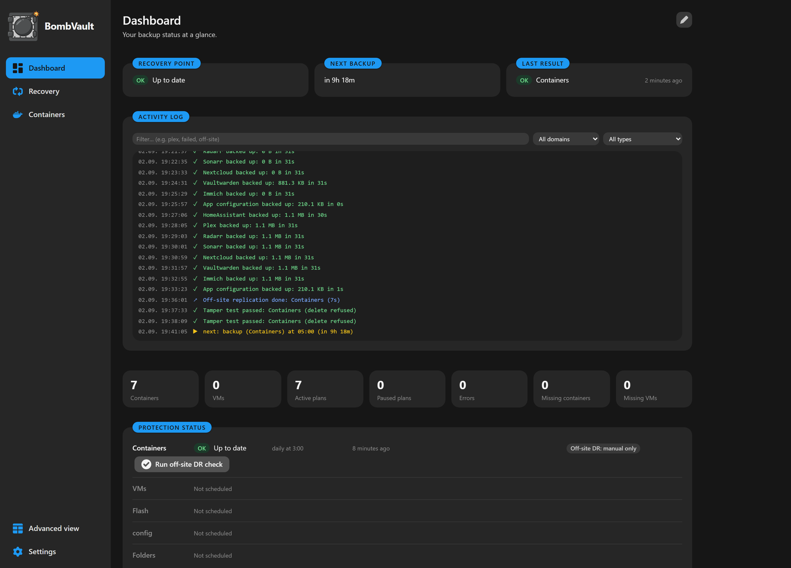
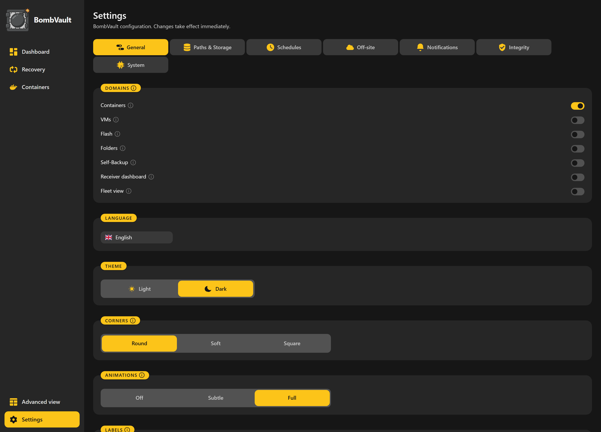

# Prise en main

Cette page vous accompagne depuis une machine Unraid vierge jusqu'à votre première sauvegarde.

## Prérequis

| Prérequis | Notes |
|---|---|
| **Unraid 6.12+** | Les versions antérieures ne sont pas testées. |
| **Emplacement du dépôt restic** | Un chemin local (recommandé : votre matrice ou votre cache), SMB, NFS, ou n'importe quel backend rclone. |
| **Socket Docker** | Monté automatiquement par le modèle (`/var/run/docker.sock`). |
| **Flash Unraid** (`/boot`) | Montée entièrement par le modèle automatiquement (`/boot` vers `/host/boot`). Alimente la sauvegarde flash et permet à un conteneur restauré de réapparaître comme une application Unraid normale et modifiable. |
| **VMs KVM** (optionnel) | La sauvegarde de VM dialogue avec libvirt via SSH, sans montage libvirt. Configurez-la dans les Paramètres (voir [Configuration](configuration.md)). |

## Installer sur Unraid

Le chemin le plus simple est **Community Applications**.

1. Ouvrez l'onglet **Apps** dans Unraid.
2. Cherchez **BombVault**.
3. Cliquez sur **Install**, définissez les variables requises (ci-dessous) et appliquez.

!!! tip "Installation manuelle du modèle"
    Si vous préférez ajouter le modèle à la main :

    1. Allez dans **Docker, Add Container, Template repositories** et ajoutez :
       ```
       https://github.com/junkerderprovinz/unraid-apps
       ```
    2. Cherchez **BombVault** dans Templates.
    3. Définissez les variables requises et cliquez sur **Apply**.

## Hôte Docker générique

Pas sur Unraid ? BombVault fonctionne aussi comme simple conteneur sur n'importe quel hôte Docker (c'est également ce qui assure la prise en charge des conteneurs sur TrueNAS Scale, avant son entrée dédiée au catalogue d'applications).

1. Récupérez le fichier [`deploy/docker-compose.generic.yml`](https://github.com/junkerderprovinz/bombvault/blob/main/deploy/docker-compose.generic.yml), prêt à éditer, depuis le dépôt.
2. Définissez `APP_KEY` (voir plus bas) et pointez le volume Host Data vers votre véritable racine de données : les commentaires du fichier détaillent les deux.
3. `docker compose up -d`, puis ouvrez `https://<ip-hôte>:3443/`.

Ce qui change par rapport à Unraid :

- **Pas de domaine flash/USB.** Il n'y a pas de clé de démarrage à capturer ou à restaurer, le domaine Flash des paramètres n'a donc rien à faire ici. À la place, le domaine Fichiers propose une suggestion en un clic, **Ajouter un préréglage : configuration système de l'hôte** (un jeu de fichiers `/etc` de départ, que vous relisez et modifiez avant d'enregistrer), comme équivalent générique utile.
- **Pas de notifications natives Unraid.** Les canaux de notification propres à BombVault (webhook, alertes d'échec hors site, etc.) fonctionnent normalement ; seule la remontée spécifique au système de notification d'Unraid est omise, puisqu'un tel système n'existe pas ici.
- **La sauvegarde de VM est optionnelle et exige un hôte libvirtd distinct joignable en SSH.** Voyez le bloc commenté du fichier compose. Un hôte Docker générique n'embarque aucun gestionnaire de VM.

## L'unique réglage requis

La seule variable que vous devez définir est `APP_KEY`, un secret hexadécimal de 32 octets (64 caractères hexadécimaux) utilisé pour dériver le mot de passe du dépôt restic.

Générez-en un sur n'importe quelle machine :

```bash
openssl rand -hex 32
```

Collez le résultat dans le champ `APP_KEY` du modèle.

!!! danger "Ne perdez pas votre APP_KEY"
    Perdre `APP_KEY` rend vos sauvegardes chiffrées irrécupérables. Conservez-le en lieu sûr et à l'écart du serveur. Une fois BombVault en fonctionnement, utilisez son **kit de récupération de clé de chiffrement** en un clic (voir [Sauvegarde hors site et récupération](offsite-recovery.md)) pour sauvegarder l'ensemble du paquet de récupération.

Le modèle monte aussi pour vous le socket Docker, la flash (`/boot`) et la racine **Host Data** (`/mnt`). Les *sources* et les *destinations* de sauvegarde vivent toutes deux sous Host Data. Pour la référence complète des variables et la configuration hors site, voir [Configuration](configuration.md).

## Première exécution



*Le tableau de bord après une première sauvegarde : ce qui est protégé, ce qui suit, et un journal en direct.*

1. Ouvrez l'interface web à `https://<votre-ip-unraid>:3443` (certificat auto-signé par défaut).
2. Dans **Paramètres**, activez les domaines de sauvegarde souhaités (Conteneurs, VMs, Flash, Config, Fichiers) et choisissez une couleur d'accentuation.
3. Dans l'onglet **Conteneurs**, choisissez un conteneur et cliquez sur **Sauvegarder** pour créer votre premier point de restauration. Les chemins de dépôt ont pour valeur par défaut `/mnt/user/bombvault/{container,vms,flash,config,files}` et sont créés à la première sauvegarde.
4. Configurez la planification depuis **Paramètres, Plannings**. Il existe une option en un clic pour *tout inclure dans le planning* pour les conteneurs et les VMs.

!!! tip "Optionnel : choisir un ordre de sauvegarde"
    Si certains conteneurs doivent toujours être sauvegardés avant d'autres (par exemple une base de données avant l'application qui l'utilise), ouvrez le panneau **ordre de sauvegarde** sur la page Conteneurs et faites-les glisser dans la séquence voulue. Les exécutions planifiées et multi-sélection la suivent alors ; tout ce que vous laissez sans ordre est sauvegardé du plus en retard au moins en retard, comme avant.

!!! note "Vérification de l'intégration hôte"
    Ouvrez `/spike` dans l'interface web après le démarrage du conteneur. Il sonde chaque montage et CLI (socket Docker, libvirt, restic, qemu-img, rclone) et signale toute pièce manquante, afin que vous puissiez confirmer que le conteneur est correctement branché avant de vous y fier.

## Simple vs Avancé



*Les réglages n'ont pas de bouton Enregistrer : chaque changement est écrit au moment où vous le faites.*

Par défaut, l'interface ne montre que l'essentiel (sauvegarder, restaurer, planifier). Utilisez le commutateur **Simple / Avancé** dans la barre latérale pour révéler les contrôles experts : rétention, copie hors site, hooks pré/post, restauration au niveau fichier, notifications, métriques Prometheus et les outils d'intégrité/maintenance. C'est une préférence par navigateur, désactivée par défaut, afin que les nouveaux venus obtiennent une interface épurée et que les utilisateurs avancés obtiennent tout.

## Étapes suivantes

- Parcourez l'ensemble des **[Fonctionnalités](features.md)**.
- Ajoutez un ou plusieurs réplicas **[Sauvegarde hors site et récupération](offsite-recovery.md)** (chaque domaine peut expédier vers plusieurs destinations à la fois) et sauvegardez votre kit de récupération.
- Vous clonez une configuration ou migrez vers une nouvelle machine ? Emportez toute votre configuration avec la carte **Exporter et importer les réglages**. Voir [Configuration](configuration.md#portable-settings-export-and-import).
- Un souci ? Voir **[Dépannage](troubleshooting.md)**.
