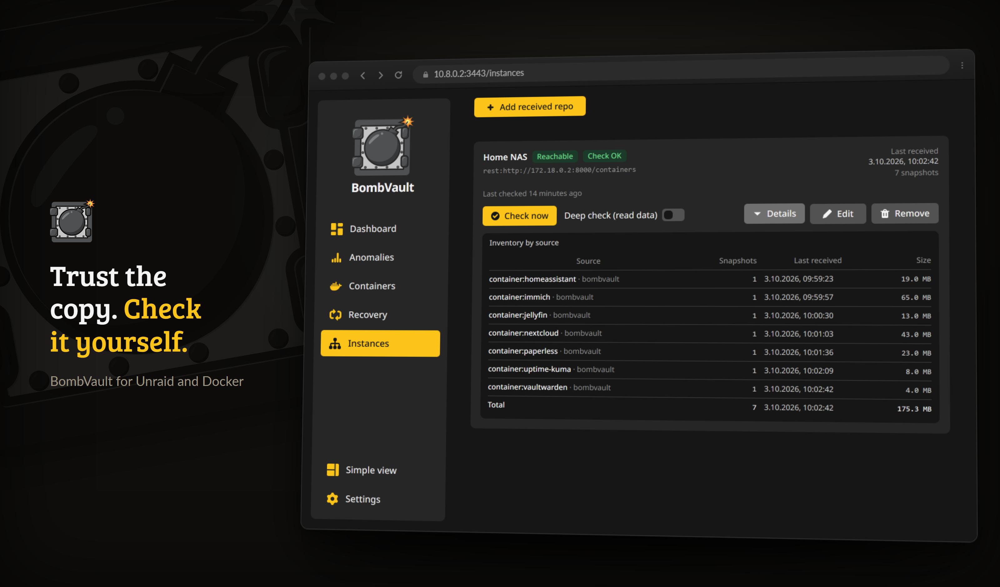

# מחוץ לאתר והתאוששות

!!! note "עותקים מחוץ לאתר ממתינים אחרי בנייה מחדש"
    כשלב 4 בונה מחדש רשומות בלי ההגדרות הישנות, שכפול מחוץ לאתר של אותם דומיינים מושהה עד שברירת המחדל של המיקום מאושרת. ראה [מיקום לכל פריט](#placement).

גיבויים מקומיים מגנים עליך מפני container אבוד או עדכון גרוע. שכפול מחוץ לאתר וערכת שחזור בדוקה מגנים עליך מפני כל התיבה, כופרה, או שריפה. עמוד זה מכסה שכפול מחוץ לאתר, הפיכת העותק הזה לחסין-חבלה, הוכחה שאתה יכול לשחזר, והתאוששות כאשר BombVault עצמה איננה.

## שכפול מחוץ לאתר

שמור על הגיבוי המקומי המהיר והוסף רפליקה אחת או יותר מחוץ לאתר. קבע מאגר לכל דומיין בעמוד **הגדרות, מחוץ לאתר**. BombVault משכפלת שם תמונות מצב חדשות עם `restic copy` על בסיס מאמץ-מיטבי, כך שתקלה מחוץ לאתר לעולם אינה מכשילה את הגיבוי המקומי. במבנה הזה המאגר המקומי נשאר הראשי והמאגר מחוץ לאתר הוא רפליקה, אבל המאגר הראשי של דומיין אינו חייב להיות מקומי בכלל; לגיבוי ישירות ל-S3, ל-rest-server וכדומה במקום שכפול אליהם, ראה [מאגרים ראשיים מרוחקים](#remote-primary-repositories) בהמשך.

- **מספר יעדים מחוץ לאתר לכל דומיין.** כל דומיין (containers, VMs, flash, config, קבוצות קבצים ומערכי נתונים של ZFS) יכול לשכפל למספר יעדים מחוץ לאתר בבת אחת, לא רק לאחד, כך שתוכל לשמור, למשל, rest-server בתיבה של חבר ו-S3 bucket במקביל. הוסף יעדים נוספים ב-הגדרות, מחוץ לאתר, כל אחד עם מאגר משלו, מחלקת אחסון S3, דגל append-only, שמירה ותקציב גדילה. הגדרת מחוץ לאתר יחידה קיימת מועברת ללא שינוי כיעד הראשון, וכל יעד של דומיין משוכפל בלוח הזמנים מחוץ לאתר של אותו דומיין.
- **לוח זמנים מחוץ לאתר לכל דומיין** (נערך לצד כל לוח זמנים אחר ב-הגדרות, תזמונים): השאר אותו ריק כדי לשכפל לאחר כל גיבוי מקומי, או קבע קצב (למשל `weekly Sun 03:00`) כדי לשלוח מחוץ לאתר בתדירות נמוכה יותר מהגיבוי המקומי. כפתור **שכפל עכשיו** מכסה הרצות לפי דרישה.
- **שמירה מחוץ לאתר** חיה ב-הגדרות, שמירה כך שתוכל לשמור עותקים מחוץ לאתר לזמן ארוך יותר כארכיון. השאר את המדיניות אפס-לגמרי כדי לעולם לא לגזום אוטומטית תמונות מצב מחוץ לאתר.
- **מגבלות רוחב פס** (הגדרות, מחוץ לאתר) מגבילות את קצב ההעלאה/הורדה של restic כך שהשכפול לא ירווה את ה-WAN שלך.
- **מחוון שכפול** מראה איזה דומיין משכפל בזמן שהוא רץ (בעמוד שלו ובלוח הבקרה). זהו מחוון פעיל, לא פס אחוזים, מכיוון ש-`restic copy` אינו חושף התקדמות קריאה-במכונה.

!!! note "שחזר מכל מקום"
    כל container, VM, קבוצת קבצים, ה-flash והגדרות האפליקציה מפרטים את הגיבויים שלהם כציר זמן אחד על פני כל המקומות שבהם גיבוי שוכן. גיבוי שהועתק ל-B2 מופיע פעם אחת, מסומן בכל מקום שמחזיק אותו. שחזור לוקח את המקום הראשון שהוא יכול להגיע אליו, החל מהמאגר שאליו הפריט נכתב, ואתה יכול לבחור מקום אחר לכל שורה. מקומות מחוץ לאתר נקראים רק כשאתה פותח אותם. מחיקה במקום אחד בודקת קודם את האחרים ואומרת אם זה היה העותק האחרון.

## יעדים {#destinations}

עמוד הגדרות, מחוץ לאתר נפתח ב-**יעדים**: המקומות שאליהם הולכים העותקים מחוץ לאתר, מוגדרים פעם אחת לכל הדומיינים. יעד מופיע אחר כך ככפתור בשורת **מיקום** של כל דומיין וכל פריט. בפעם הראשונה שהוא מסומן עבור דומיין, BombVault יוצרת את המאגר של אותו דומיין בתיקייה תחתיו, למשל `rclone:onedrive:BombVault/containers`.

**הוסף יעד** פותח אשף בחמישה שלבים:

1. **לאן לשלוח את הגיבויים?** כל שירות מופיע עם הלוגו שלו, בארבע קבוצות: שירותי אחסון עם S3 buckets (Backblaze B2, Wasabi, Cloudflare R2, Hetzner Object Storage, Amazon S3 ואחרים), שרת S3 משלך (Garage, SeaweedFS, RustFS, Silo, Ceph, JuiceFS, Versity S3 Gateway), שרת ושיתופים משלך (rest-server, Hetzner Storage Box, SFTP, SMB, WebDAV, נתיב מחובר) ואחסון ענן (OneDrive, Google Drive, Dropbox, pCloud, Nextcloud וכל השאר ש-rclone תומך בהם). כל אחד מציין עד כמה הוא מתאים לגיבויים: כוננים בענן מאטים תחת הרבה בקשות, ולכן הגיבוי הראשון והגיזום לוקחים שם יותר זמן.
2. **התחברות.** השדות תלויים בשירות: מפתח גישה ל-S3, משתמש וסיסמה ל-WebDAV ול-SMB, סיסמת אפליקציה במקום שאימות דו-שלבי חוסם את הרגילה, המפתח הציבורי של BombVault ל-SSH עבור SFTP וה-Storage Box, או אסימון לשירותים שמתחברים דרך דפדפן. עבורם האשף מציג פקודת `rclone authorize` להרצה במחשב עם דפדפן; האסימון שהיא מדפיסה נכנס לשדה. **בדוק חיבור** בודק את ההתחברות לפני ששום דבר נשמר.
3. **בחר תיקייה.** האשף מציג את התיקיות ביעד, עם **תיקייה חדשה** ליצירת תיקייה ועם המקום הפנוי כשהשירות מדווח עליו. תיקייה ריקה היא הבטוחה ביותר.
4. **הגנה מפני מחיקה.** האשף אומר בפשטות מה השירות יכול לעשות. rest-server במצב append-only מסרב למחיקה, ובדיקת החבלה מוודאת זאת. S3 bucket יכול לשמור גרסאות ישנות באמצעות ניהול גרסאות ונעילת אובייקטים, ש-BombVault עדיין לא יכולה לבדוק. כונן בענן לא יכול לסרב למחיקה בכלל: מי שנכנס לשרת נכנס גם לעותק הזה. הפעל **בלתי ניתן לשינוי (append-only)** רק היכן שהצד השני באמת מסרב למחיקה; BombVault אז אף פעם לא גוזמת שם.
5. **למקרה חירום.** ערכת השחזור מפרטת כל יעד עם המאגר של כל דומיין תחתיו. ההתחברות חוזרת עם הגיבוי של ההגדרות של BombVault; בהתקנה חדשה בלעדיו, הגדר את היעד מחדש באותו מקום.

שירותי S3 עוברים דרך ה-backend ה-S3 של restic עצמו, וזה מה שמאפשר להחיל מחלקת אחסון ונעילת אובייקטים. כל שירות אחר עובד דרך ה-rclone ש-BombVault מספקת, וה-remote שלו מופיע אז בתצורת rclone תחת הגדרות, גישה לענן. ייצוא הגדרות כולל את היעדים; עם פרטי התחברות כלולים הוא כולל גם את ההתחברות אליהם.

שרת מקלט שמפעיל מופע אחר בקבוצה שלך מופיע באשף תחת **מהקבוצה שלך**; ראה [שרת מקלט](#receiving-server).

יעד של דומיין שנוצר מתוך יעד לוקח את השם, המיקום, פרטי ההתחברות, מחלקת האחסון ומתג ה-**בלתי ניתן לשינוי** של היעד. השמירה, הדחיסה ותקציב הגדילה שלו נשארים לפי דומיין, והמיקום שלו לא יכול לזוז כי המאגר של הדומיין נמצא שם. **הוסף יעד לתחום הזה בלבד** תחת כל דומיין עדיין מקבל כתובת מאגר שהוקלדה ידנית.

יעד שהוקלד ידנית והמאגר שלו נמצא בתיקייה של יעד יכול להצטרף אליו. היעד מפרט יעדים כאלה תחת **כבר נמצא תחת היעד הזה**, ו**אימוץ** תולה אחד מהם עליו. היעד שומר על המאגר, ה-snapshot, השמירה והמיקום שלו, ולוקח את השם, פרטי ההתחברות, מחלקת האחסון ומתג ה-**בלתי ניתן לשינוי** של היעד. BombVault בודק קודם שההתחברות של היעד פותחת את המאגר, ומסרב להעמיד יעד append-only תחת יעד שאינו append-only. אימוץ היעד הראשי של דומיין מרוקן את שדה ה-off-site של אותו דומיין.

## מיקום לכל פריט {#placement}

לכל כרטיס container, VM וקבוצת קבצים יש שורת כפתורים **מיקום**: **מקומי** וכפתור אחד לכל יעד מחוץ לאתר של הדומיין, ואחריהם היעדים שלדומיין עוד אין יעד תחתיהם. כפתורים דלוקים מקבלים את הגיבויים של הפריט.

- כש-**מקומי** דלוק, הפריט נכתב למאגר המוצג תחת **מאוחסן ב** ומועתק לכל יעד דלוק אחר. כבה יעד והוא לא מקבל דבר חדש מהפריט הזה. מקומי לבדו לא מעתיק לשום מקום, וזה מתאים לנתונים שכבר יש להם עותק שני, למשל שיתוף שיושב על NAS.
- כש-**מקומי** כבוי, הפריט נכתב ישירות למאגר הישיר של היעד הדלוק הראשון ומועתק משם ליעדים הדלוקים האחרים. בפעם הראשונה תיבת דו-שיח יוצרת את המאגר הישיר הזה.
- כפתור של יעד יוצר את היעד של הדומיין תחת אותו יעד ומדליק אותו עבור הפריט הזה בלבד. כל פריט אחר מתחיל שם בלי עותק.
- כפתור אחד נשאר דלוק, כי לגיבוי צריך להיות לאן ללכת. כדי להשאיר משהו מחוץ לגיבויים, הוצא אותו מהם.

המיקום קבוע מהגיבוי הראשון של הפריט ואילך, כי BombVault לעולם לא מזיזה גיבויים בין מאגרים. העותקים יכולים להשתנות בכל עת. יעד שכבר לא מקבל פריט שומר את העותקים שיש לו ומצמצם אותם לשמירה שלו בהרצה החיצונית הבאה של הדומיין; **מחיקה ב-B2** בכרטיס מסירה אותם מיד. כשחלק מהעותקים האלה לא קיימים בשום מקום אחר, האישור מפרט אותם לפי תאריך ומבקש את שם הפריט. אי אפשר למחוק מיעדי הוספה-בלבד.

מתחת לשורה הכרטיס אומר לאן הפריט הולך ומה באמת שם: כמה אתרים מחזיקים אותו, מתי כל יעד נראה לאחרונה, ואם 3-2-1 מתקיים. אתר הוא השרת עם הנתונים המקוריים, כל יעד מחוץ לאתר וכל מאגר המסומן **מחוץ למבנה**. BombVault בודקת עותקים ואתרים; היא לא בודקת את חלק ה"שני מדיה" של 3-2-1.

### ברירות מחדל של מיקום

הגדרות, אחסון, **ברירות מחדל של מיקום** מכיל שורה אחת לכל דומיין עם אותם כפתורים. העותקים חלים מיד על כל פריט בלי בחירה משלו, ועל תיקיות הפרויקט של מחסניות Compose. המיקום חל על פריט חדש בגיבוי הראשון שלו; שינויו לא מזיז אף גיבוי. לפני השמירה, השורה נוקבת בשם כל יעד שמרוויח או מפסיד פריטים וכמה תצלומים זה אומר. **החלה על פריטים בלי גיבויים** מחזירה לברירת המחדל כל פריט שעוד אין לו גיבוי.

יעד מחוץ לאתר חדש מקבל כל פריט שלא מוגדר למקומי. תיבת הדו-שיח שמוסיפה אותו אומרת כמה פריטים ו, כשידוע, כמה היסטוריה זה, ומציעה להשאיר בחוץ את הפריטים שכבר הוחרגו מיעדים אחרים.

### מאגרים ישירים

כיבוי מקומי עבור פריט, כך שיעד בלי מאגר ישיר הופך לביתו, פותח תיבת דו-שיח עם מיקום מוצע לצד היעד, למשל `s3:https://s3.eu-central-003.backblazeb2.com/bucket/containers-direct`, ובדיקת חיבור שלא יוצרת דבר. **צור והשתמש** יוצר את המאגר ומצביע את הפריט אליו. מאגר ישיר לוקח את המפתח, מחלקת האחסון, המגבלות, הגדרת ה-append-only והשמירה של היעד, ומשתנה איתם; כרטיס המאגרים מציג אותו לקריאה בלבד. כשמפתח חדש של היעד לא יכול לפתוח אותו, המאגר הישיר שומר את המפתח שיש לו וההצלה אומרת זאת. פריט במאגר ישיר מועתק משם ליעדים הדלוקים האחרים, אף פעם לא ליעד שהמאגר שייך לו. תמונות המצב שלו נושאות את התג `bv:direct`, וכל מעבר שמירה אחר משאיר אותן, כך שמאגר ישיר שאיבד את הקשר שלו ליעד לעולם לא מזדקן לפי הכללים המקומיים. מגיעים אל B2 דרך נקודת הקצה שלה ב-S3, כאשר מזהה המפתח ומפתח היישום מוזנים כפרטי ההתחברות ל-S3; מפתח המוגבל לתיקייה של היעד עצמו לא יכול להגיע לתיקייה הסמוכה לה, לכן הגבל את המפתח במקום זאת לתיקייה שמעל היעד.

### מחוץ למבנה

מאגר בעל שם יכול להיות מסומן **מחוץ למבנה** בכרטיס המאגרים. מאגרים מרוחקים מתחילים מסומנים; כבה זאת עבור rest-server באותו מבנה. הסימון סופר רק אתרים ו-3-2-1 בכרטיסים. הוא לא משנה שום עותק.

### אחרי בנייה מחדש

בחירות ההעתקה חיות בהגדרות של BombVault עצמה. אחרי בנייה מחדש דרך גלה גיבויים בלי `/config` משוחזר הן נעלמות, והעתקת הכול הייתה שולחת שוב ל-B2 את הפריטים שהשארת בחוץ. לכן שכפול מחוץ לאתר של כל דומיין שנבנה מחדש מושהה. לוח הבקרה מראה זאת בכתום, וברירות מחדל של מיקום מציעות **אישור ברירת המחדל** עם תצוגה מקדימה של מה שההרצה הבאה מעתיקה והשמות בגיבויים שאין להם רשומה, שאפשר להשאיר בחוץ שם. רק האישור מסיים את ההשהיה; ייבוא קובץ הגדרות מחזיר כללים וברירות מחדל אבל לא מסיים אותה.

## מאגרים ראשיים מרוחקים {#remote-primary-repositories}

נתיב הגיבוי של תחום (הגדרות, אחסון) אינו מוגבל לתיקייה מקומית: כוון אותו ישירות אל מאגר restic מרוחק (`s3:...`, `rest:http://host:8000/repo`, `sftp:user@host:/repo`, `rclone:remote:bucket/path`) ו-BombVault יגבה ישר לשם, בלי עותק מקומי נפרד ובלי שלב שכפול. זו צורה שונה באמת מהשכפול מחוץ לאתר שלמעלה: שם המאגר המקומי הוא הראשי והמאגר שמחוץ לאתר הוא ארכיון שלו כמיטב היכולת; כאן המאגר המרוחק **הוא** הראשי, והוא העותק היחיד כל עוד לא הגדרת לאותו תחום גם שכפול מחוץ לאתר (או מאגר מרוחק שני).

לכל אחד מששת שדות הנתיב (Containers, VMs, Flash, גיבוי עצמי, תיקיות, מערכי נתונים של ZFS) יש ממש לידו מתג **מקומי / מרוחק**:

- **מקומי** מציג את סייר התיקיות המוכר.
- **מרוחק** מחליף אותו בשדה כתובת פשוט, ולצידו כפתור שפותח את אותו חלון בדיקת חיבור ופרטי הזדהות שיעדים מחוץ לאתר משתמשים בו, אלא שהוא מוגדר עבור המאגר הראשי הזה. משם אתה מקבל:
    - **בדיקת חיבור** אל הנתיב האמיתי, לפני שאתה סומך עליו.
    - **מגבלות רוחב פס** (העלאה והורדה), כדי שגיבוי מתוזמן אל מאגר ראשי מרוחק לא יחנוק את קו ה-WAN שלך: אותם דגלי restic, `--limit-upload` ו-`--limit-download`, שהשכפול מחוץ לאתר משתמש בהם, מוחלים כאן על הגיבוי עצמו.
    - **הגנת append-only (אי-שינוי)**, מאומתת באותה בדיקת חבלה פעילה (בדיקת DELETE אמיתית מול הצד השני) שיעדים מחוץ לאתר מקבלים. כשהיא פועלת, BombVault מסרב לגזום את המאגר בעצמו: מכיוון שאין מאחוריו עותק מקומי נפרד, פרטי ההזדהות במכונה הזו אינם אמורים להיות מסוגלים למחוק את העותק היחיד של הגיבוי.
    - **התראת תקציב גדילה**, הנגזרת מאותה מגמת גודל מאגר שכרטיס האחסון עוקב אחריה ממילא.

שום דבר מזה אינו חובה: נתיב מרוחק שהוקלד ביד, בלי הגדרות בטיחות שמורות, מגבה בדיוק כמו קודם (רוחב פס בלתי מוגבל, ניתן לגזימה, בלי התראת תקציב). חלון הבטיחות קיים למקרה שתרצה את אותן הגנות שעותק מחוץ לאתר מקבל, בלי שתצטרך ליצור יעד מחוץ לאתר רק בשביל זה.

!!! note "פרטי ההזדהות לענן ול-REST משותפים"
    מאגר ראשי מרוחק מזדהה באותם פרטי S3/REST שהוגדרו תחת הגדרות, גישה לענן, פרטי גישה משותפים לענן. אין מאגר נפרד לפרטי הזדהות של מאגרים ראשיים.

### SMB ו-WebDAV בלי עיגון במארח {#smb-webdav}

תחת הגדרות, גישה לענן, rclone יש טופס לשיתוף Windows או Samba ולשרת WebDAV (Nextcloud, ownCloud, SharePoint או כל שרת אחר). מלא שם קצר, את המארח והשיתוף (SMB) או את ה-URL וסוג השרת (WebDAV), את המשתמש ואת הסיסמה, ו-BombVault כותבת עבורך את מקטע ה-rclone. rclone מערפל את הסיסמה בעצמו לפני שהיא נשמרת; הוספת יעד עם שם שכבר קיים מחליפה את המקטע הזה במקום להוסיף מקטע שני.

הטופס עונה עם המיקום המוכן, למשל `rclone:nas:backups`. הכנס אותו לנתיב גיבוי או ליעד מחוץ לאתר והוסף תת-תיקייה אם תרצה (`rclone:nas:backups/bombvault`). השיתוף הוא מקטע הנתיב הראשון, לא חלק מהשם.

זו דרך טובה יותר מעיגון השיתוף ב-Unraid: restic ממליץ שלא להחזיק מאגר על שיתוף CIFS מעוגן, וכאן שום דבר אינו מעוגן. NFS אינו בטופס כי אין ל-restic ולא ל-rclone backend של NFS; ל-NFS, עגן את הייצוא במארח והפנה אליו נתיב גיבוי.

## מחוץ לאתר בלתי-ניתן-לשינוי (append-only)

סמן מאגר מחוץ לאתר כ-append-only כך שכופרה, או מארח שנפרץ, אינם יכולים למחוק או לשכתב את הגיבויים שלך. הצד הרחוק (`restic/rest-server` הרץ במצב `--append-only`) **אוכף** זאת. BombVault רק **מאמתת** זאת ולעולם אינה מציגה ירוק על טענת תצורה בלבד.

אשף **הגדרת מחוץ לאתר המודרכת** מוליך אותך מבחירת backend (rest-server / rclone / S3) דרך קטע פריסה מוכן-להדבקה של rest-server, בדיקת חיבור, מתג הבלתי-ניתן-לשינוי (שמריץ את בדיקת החבלה מיד) ואסטרטגיית שמירה, כך שמחוץ לאתר append-only נגיש ללא עריכת תצורות ידנית.

!!! note "מחיקה מוצלחת תחת `/locks/` היא התנהגות צפויה"
    Append-only לא אומר שכבר אי אפשר למחוק דבר. restic חייב ליצור ולשחרר את הנעילות שלו, ולכן `/locks/` נשאר בכוונה ניתן לכתיבה ולמחיקה. תמונות המצב והנתונים שמאחוריהן, כלומר בדיוק מה שכופר היה מחפש, אינם ניתנים להסרה. אם תבדוק בעצמך את הצד המרוחק, מחיקה שמצליחה תחת `/locks/` היא התנהגות נכונה ולא חור בהגנה.

!!! warning "מאגרים בלתי-ניתנים-לשינוי לעולם אינם נגזמים מהתיבה הזו"
    מחוץ לאתר בלתי-ניתן-לשינוי בכוונה לעולם אינו גוזם תמונות מצב ישנות. קבע לו **התראת תקציב-גדילה** כך שתקבל התראה לפני שגודל המאגר בורח.

## בדיקת חבלה

BombVault מוכיחה מעת לעת את ערבות ה-append-only על ידי ניסיון מחיקה בפועל מול המאגר מחוץ לאתר, המכוון לאובייקט לא-קיים:

- **סירוב** פירושו מוגן.
- **קבלה** פירושה לא מוגן.
- תוצאה **בלתי-חד-משמעית** (שרת בלתי-נגיש, שגיאת אימות) לעולם אינה הופכת את הפסק המאוחסן.

מהפך אמיתי ממוגן-ללא-מוגן מפעיל התראה יחידה.

## תרגולי DR

BombVault מציעה שתי רמות הוכחה שהגיבויים שלך באמת ניתנים לשחזור, לא רק נוכחים.

- **תרגולי אימות-שחזור (מקומי).** BombVault מריצה מעת לעת `restic check --read-data-subset` (מוגבל, לעולם לא שחזור מלא ממלא-דיסק) ומציגה תג *אומת כניתן לשחזור* לכל דומיין. הקצב חי ב-הגדרות, תזמונים; התג ב-הגדרות, שלמות.
- **תרגולי DR (מחוץ לאתר).** BombVault משחזרת יעד אמיתי מהמאגר מחוץ לאתר לתוך ארגז חול חד-פעמי, מאמתת אותו קובץ-אחר-קובץ ובית-אחר-בית, ואז מנקה. זה מוכיח שאתה יכול להתאושש ממחוץ לאתר, לא רק שהמאגר עונה.

**כרטיס-הניקוד להגנה מפני כופרה** בלוח הבקרה מגלגל זאת לעמדה ירוקה / כתומה / אדומה לכל דומיין, עם רשימת בדיקה עם חותמת גיל (מחוץ לאתר מוגדר, append-only מאומת, שכפול עדכני, תרגול שחזור עבר, הצפנה מופעלת, אסטרטגיית גיזום מוגדרת). כל שורה אדומה מקשרת עמוק לתיקון, והכרטיס הופך לירוק רק על עובדות מאומתות.

## צימוד מופעים {#pairing}

מקבלים, מקורות משיכה, עמוד המופעים וה-Mesh מחוץ לאתר, כולם מדברים עם BombVault אחר. הם עושים זאת כחברים בקבוצת צימוד אחת, ומופע מצטרף לקבוצה באמצעות שתים-עשרה מילים.

במופע הראשון פתח **הגדרות ← צימוד** ולחץ על **יצירת ביטוי** בכרטיסי הצימוד. שתים-עשרה מילים מופיעות בחלון עם כפתור **העתק**. בכל מופע אחר פתח את אותו מקום, לחץ על **הזנת ביטוי** והדבק אותן או הקלד אותן, או לחץ על **הדבק** בחלון הזה. מילה שאינה ברשימה מצוינת עם מיקומה כבר בזמן ההקלדה, והמילה האחרונה נושאת checksum, כך שמילה שהוקלדה בטעות או הוחלפה נתפסת לפני שמתבצע צימוד כלשהו. צור את הביטוי במופע אחד בלבד: שני מופעים שכל אחד מהם יוצר ביטוי יוצרים שתי קבוצות נפרדות. אם איש לא מופיע תוך דקה, הלשונית מציעה שתי דרכים החוצה: להציג את המילים שוב כדי להזין אותן שם, או להזין את מילות המופע האחר ולהצטרף לקבוצה שלו בצעד אחד. הצימוד עובד גם בלי סיסמת כניסה, אבל הגדר אחת: בלעדיה כל מי שיכול לפתוח את הממשק הזה יכול לקרוא את המילים ולקבל, דרך הקבוצה, את סיסמת ה-restic של כל מופע בה. כרטיס הצימוד מציין זאת כל עוד לא הוגדרה סיסמה. עם סיסמה, הצגת הביטוי שוב תבקש אותה. **עזוב את הקבוצה** מוציא מופע החוצה שוב.

כל מי שיודע את המילים יכול להצטרף לקבוצה, אז התייחס אליהן כמו לסיסמה.

**איך חברים מגיעים זה לזה.** כל מופע לומד את הכתובת שלו ברשת מהדפדפן שלך ברגע שאתה מתחבר, מוצג בכרטיס הממסר בתור **המופע הזה ברשת שלך**; תקן אותה שם אם reverse proxy או פורט חריג נמצאים מולה. באותה רשת חברים מכריזים על הכתובת הזו באמצעות multicast ומדברים ישירות, ובמקום שבו multicast לא יכול לחצות רשת מכולות, כמו רשת ה-bridge שבברירת המחדל של Docker, מופע מחפש במקום זאת ב-subnet שלו את האחרים בקריאה חתומה שרק חבר בקבוצה יכול לענות עליה, כך שהצימוד עדיין נגמר תוך שניות בלי ממסר. אם שום דבר לא נמצא, **לא מוצא אותו?** מתחת לכרטיס הצימוד מקבל כתובת אחת ידנית, ל-subnet אחר או לפורט לא סטנדרטי. מופעים ברשתות שונות עוברים דרך ממסר, שנבחר באותה לשונית:

- **ממסר הפרויקט** (ברירת המחדל): `parleyport.halleluja.design`, הממסר שגם KnightLoader משתמש בו. אין מה להגדיר.
- **ממסר עצמי**: מכולת [**ParleyPort**](https://github.com/junkerderprovinz/parleyport) מה-Unraid Community Apps, או אחד מהמופעים שלך שכבר נגיש מבחוץ עם **שמש כממסר** מופעל. אותו מופע אז עונה בכתובת `/relay/connect` בכתובת שלו עצמו, מאחורי ה-reverse proxy והתעודה שכבר יש לו, ומכניס רק את הקבוצה שלך. הזן את כתובת הממסר בכל מופע שאמור להשתמש בו.
- **בלי ממסר**: חברים מוצאים זה את זה אוטומטית רק באותה רשת, ולא בשום מקום אחר.

**מה הממסר רואה.** כל שיחה בין חברים נחתמת עם AES-256-GCM תחת מפתח הנגזר משתים-עשרה המילים, ואותו מפתח לעולם אינו עוזב את המופעים שלך. הממסר לומד hash שמקבץ את החיבורים, לאיזה מופע הודעה מיועדת, מה גודלה ומתי היא עוברת. שיחה ישירה ברשת המקומית נחתמת באותו אופן וגם חתומה, כך ששום דבר אינו תלוי בתעודה החתומה-עצמית שמופע מגיש.

**מה עובר דרך הקבוצה.** כרטיסי-הניקוד בעמוד המופעים, בקשה לבדוק דומיין אחד עכשיו, הצעות האחסון מחוץ לאתר של ה-Mesh, ואת מה שמקבל או מקור משיכה זקוקים לו: מיקומי המאגר של המופע האחר וסיסמת ה-restic שלו. נתוני גיבוי, לעומת זאת, לעולם לא: הם עדיין הולכים ישר ל-backends של restic. גם לא ה-APP_KEY: סיסמת ה-restic פותחת את המאגרים של אותו מופע ושום דבר אחר, לא את הסודות המאוחסנים שלו, לא את ה-sessions שלו ולא את קודי השחזור שלו.

**רשומות מלפני הצימוד.** מופעים שנוספו עם אסימון fleet, ומקבלים ומקורות משיכה שהוגדרו עם ה-APP_KEY של המופע האחר, נשארים אחרי העדכון ומסומנים **צמד מחדש**. מקבלים ומקורות משיכה ממשיכים לעבוד: בהפעלה הראשונה שלו BombVault מחליף כל APP_KEY מאוחסן בסיסמת ה-restic הנגזרת ממנו. צמד את שני המופעים, ואז ערוך את הרשומה ובחר את המופע שלה. מופע כזה נוטל את הכרטיס הישן שלו ברגע שמופע באותו שם מופיע בקבוצה.

המקום היחיד שעדיין לוקח APP_KEY ידנית הוא [שחזור ממאגר BombVault אחר](#restore-from-another-bombvault-repo), למקרה שהמופע האחר נעלם ואינו יכול לענות בקבוצה.

## לוח בקרה של מקבל (הצד המקבל)



*הצד המקבל, מנוטר לקריאה בלבד, עם בדיקת שלמות שרצה על המכונה הזו.*

כל מה שלמעלה הוא הצד *השולח*. בתיבה ש**מקבלת** עותקים בלתי-ניתנים-לשינוי מחוץ לאתר מ-BombVault אחר, לוח הבקרה של המקבל נותן לך ניטור עצמאי לקריאה בלבד של המאגרים האלה על חומרת הקבלה, כך שכשל שקט בקצה הרחוק אינו נותר בלתי-מורגש.

הפעל את מתג **מקלט** בהגדרות כדי לחשוף לשונית **מקלט**. הוא כבוי כברירת מחדל; הפעל אותו רק בתיבה שבאמת מקבלת גיבויים בלתי-ניתנים-לשינוי מחוץ לאתר. לאחר מכן רשום מאגר שהתקבל (לקריאה בלבד, נפתח עם סיסמת ה-restic של המופע השולח, שהוא מקבל דרך [קבוצת הצימוד](#pairing)) כדי לקבל:

- **מלאי תמונות מצב מקובץ לפי מקור**, כך שתוכל לראות בדיוק אילו containers, VMs וקבוצות קבצים נחתו.
- **התקבל-לאחרונה** לכל מקור, כך שתדע כמה טרי כל אחד.
- **`restic check` עצמאי** הרץ על חומרת הקבלה, כך שהשלמות מאומתת היכן שהנתונים באמת יושבים, לא רק אצל השולח.
- **מפסק מת:** התראה כאשר מקור מפסיק לשלוח בתוך חלון שאתה קובע.
- **התראות שלמות:** התראה כאשר בדיקה בצד הקבלה נכשלת.

המקבל הוא לקריאה בלבד באופן מחמיר. הוא לעולם אינו כותב למאגר שהתקבל, כך שהוא לעולם אינו יכול לשבור את ערבות ה-append-only שהשולח מסתמך עליה.

### שרת מקלט {#receiving-server}

תיבת הקבלה יכולה להפעיל גם את ה-rest-server שהאחרים מעתיקים אליו. **הגדרת שרת מקלט** בראש לשונית **מקלט** מבקש תיקייה בשיתוף (share), עם **תיקייה חדשה** ליצירת אחת, ופורט (8000, אלא אם container אחר משתמש בו). אז BombVault:

1. מסרב להמשיך אם כבר קיים container בשם `rest-server` או אם container אחר מחזיק בפורט;
2. מושך את `restic/rest-server` ומפעיל אותו דרך ה-Docker socket במצב append-only עם מאגרים פרטיים וקובץ התחברות בתיקייה;
3. כותב את תבנית ה-Unraid שלו לכונן ה-flash, כך שה-container נשאר ניתן לעריכה בלשונית Docker, או מציע את התבנית להורדה כשכונן ה-flash אינו בהישג יד;
4. מריץ עליו את בדיקת החבלה ומראה אם הוא מסרב למחיקות.

המופעים בקבוצה שלך מוצאים אז את השרת באשף היעד תחת **מהקבוצה שלך**, בשם תיבת הקבלה. כל מופע מקבל התחברות משלו בפעם הראשונה שהוא בוחר בשרת, וכותב שם רק לתיקייה שלו. הכרטיס מפרט את ההתחברויות האלה, ו**ביטול פרטי ההתחברות** מסיר אחת מהן; מה שאותו מופע כבר העתיק נשאר בתיקייה. ההגדרה יוצרת גם התחברות אחת למי שמחוץ לקבוצה, והכרטיס מציג את הסיסמה שלה פעם אחת.

מופע שמגיע לתיבת הקבלה רק דרך הממסר אינו יכול להשתמש בשרת, כי הממסר אינו נושא גיבויים. הוסף קודם את כתובת תיבת הקבלה תחת **הגדרות ← צימוד**. כש-BombVault רצה על כתובת IP משלה (ב-br0, למשל), מלא את **כתובת לשותפים**, כי השרת מאזין לכתובת המארח.

## דוגמה מלאה: שני מחשבי Unraid, מקצה לקצה

למעלה מתוארים החלקים. כאן יש התקנה שלמה אחת עם ערכים אמיתיים, כי הרבה יותר קל להרכיב חלקים אחרי שראית אותם מורכבים פעם אחת.

שני מחשבים: **TOWER** מריץ את המכולות ושולח את הגיבויים, ו-**VAULT** מקבל אותם ואוכף את אי-השינוי. החלף בשמות, בכתובות ובנתיבי השיתוף שלך.

**1. ב-VAULT הקם את שרת ההוספה-בלבד.** ב-BombVault על TOWER עבור אל *הגדרות ← מחוץ לאתר ← הגדרה*, בחר **rest-server** וצור את המתכון. העתק את הלשונית **תבנית Unraid (XML)**, שמור אותה ב-VAULT בשם `/boot/config/plugins/dockerMan/templates-user/my-rest-server.xml`, ואז *Docker ← Add Container* ובחר **rest-server** מרשימת התבניות. לפני ההפעלה כתוב את שורת ה-`htpasswd` המוצגת אל `/mnt/user/appdata/rest-server/.htpasswd` ב-VAULT. הסיסמה החד-פעמית מוצגת פעם אחת ואינה נשמרת לעולם, אז העתק אותה עכשיו. השורה הזו נושאת את אותה סיסמה, כבר מגובבת ב-bcrypt עבורך: הטקסט הגלוי נכנס לפרטי ההזדהות של REST ב-TOWER, והשורה המגובבת נכנסת ל-`.htpasswd` ב-VAULT. אינך צריך לגבב דבר בעצמך.

    השאר את `--append-only` בשדה OPTIONS. זה כל העניין: בלעדיו VAULT חוזר להיות שיתוף רגיל.

**2. ב-TOWER כוון את המאגר החיצוני לשם.** כתובת המאגר עוקבת אחר התבנית שהמתכון מדפיס:

    rest:http://VAULT:8000/bombvault-containers/containers

החלק הראשון בנתיב הוא משתמש ה-htpasswd, השני הוא המאגר. הזן את המשתמש והסיסמה שנוצרו כפרטי ההזדהות של היעד ב-REST, ואז הרץ את **בדיקת החיבור**.

**3. ב-TOWER הפעל את «בלתי ניתן לשינוי».** בדיקת החבלה רצה מיד וחייבת לומר *מוגן*. מה משמעות התשובות:

| תוצאה | מה קרה |
| --- | --- |
| **מוגן** | VAULT סירב למחיקה. זה המצב היחיד שעובר. |
| **לא מוגן** | VAULT קיבל מחיקה. `--append-only` חסר או הוסר. |
| **לא חד-משמעי** | לא זה ולא זה. בדרך כלל הכתובת אינה זו ש-restic עצמו משתמש בה, או שפרטי ההזדהות השתנו. שום דבר אינו נרשם ואף התראה אינה נשלחת. |

**4. ב-VAULT הסתכל מה מגיע.** צמד את שני המחשבים ([צימוד מופעים](#pairing)), הפעל *הגדרות ← כללי ← מקלט*, פתח את הלשונית **מקלט** ורשום את המאגר לקריאה בלבד עם TOWER כמופע השולח.

!!! warning "המיקום הוא נתיב **בתוך** המכולה, כתוב יחסית לנקודת העגינה של המארח"
    הזן `user/appdata/rest-server/bombvault-containers/containers`, **ולא** `/mnt/user/appdata/…`. BombVault רץ במכולה שבה ה-`/mnt` של המארח מעוגן במקום אחר; נתיב מוחלט של המארח אינו קיים שם. אם תדביק כזה, BombVault יאמר לך עכשיו איזה נתיב יחסי להשתמש בו במקום.

    VAULT מקבל את סיסמת ה-restic של TOWER דרך הקבוצה כשאתה שומר; אף אחד לא מקליד מפתח.

**5. אם תרצה, עשה זאת הדדי.** חזור על אותם חמישה שלבים בכיוון ההפוך: rest-server על TOWER שמקבל את העותק של VAULT. אז כל מחשב אוכף את אי-השינוי עבור השני, ואף אחד מהם אינו יכול למחוק את הגיבויים של האחר.

## התאוששות מודרכת

לשונית **התאוששות** ייעודית מוליכה התקנה טרייה או בנויה-מחדש דרך מקרה האסון, במקום אחד:

1. **משחזרת קודם את ההגדרות של BombVault עצמה**, כך שנתיבי הגיבוי, היעדים מחוץ לאתר ופרטי ההתחברות שיתר הזרימה זקוקה להם מגיעים מלאים מראש (מיושמים דרך הפעלה-עצמית מחדש מעל ה-Docker socket, כך שמסד נתוני ההגדרות הפעיל לעולם אינו נדרס תחת handle פתוח).
2. **בודקת ש-BombVault יכולה לקרוא את הגיבויים שלך** (מלכוד מפתח ההצפנה מלפנים).
3. מאפשרת לך **להצביע על המאגר הקיים שלך** (מקומי או מחוץ לאתר).
4. **מגלה** את ה-containers, VMs, קבוצות הקבצים ומערכי הנתונים של ZFS המאוחסנים בו.
5. **משחזרת את ה-containers וה-VMs בבת אחת** (מושארים עצורים, כך שאתה מפעיל אותם בכוונה) ומציגה את קבוצות הקבצים ופריטי ה-ZFS לשחזור אחד אחד; פריטי ZFS חוזרים כבויים. ערכת השחזור שלך במרחק לחיצה אחת.

!!! tip "מעבר מתוכנן מול אסון"
    התאוששות מודרכת משחזרת את ההגדרות של BombVault עצמה מגיבוי. למעבר *מתוכנן* לתיבה חדשה, אתה יכול במקום זאת לשאת את התצורה שלך ישירות עם כרטיס **ייצוא / ייבוא הגדרות** (קובץ JSON נייד). ראה [הגדרות](configuration.md#portable-settings-export-and-import).

### שחזור ממאגר BombVault אחר {#restore-from-another-bombvault-repo}

כרטיס נפרד בלשונית **התאוששות** פותח את המאגר של מופע BombVault *אחר* (שיתוף מעוגן תחת `/mnt`, או כתובת URL מרוחקת) עם **ה-`APP_KEY` של אותו מופע**, ב-session חד-פעמי לקריאה בלבד. עיין ב-containers, VMs וקבוצות הקבצים המאוחסנים שם, בחר תמונת מצב ושחזר אותה, והאובייקט המשוחזר הופך ל-container, VM או קבוצת קבצים מקומיים רגילים. שום דבר לעולם אינו נכתב למאגר האחר, והגדרות הגיבוי שלך נשארות ללא נגיעה (ה-session חי בזיכרון ופג בעצמו). העברת container משרת A לשרת B אינה אומרת להצביע מחדש את הגדרות המאגר שלך ולהחזיר אותן אחר כך. הכרטיס הזה הוא חד-פעמי: הוא פותח session, משחזר את מה שבחרת, ושוכח את המופע האחר. אם אתה רוצה במקום זאת הסדר קבוע, שבו התיבה הזו מושכת לפי לוח זמנים את תמונות המצב של מופע אחר אל המאגר שלה, זו הלשונית **משיכה** בעמוד **מופעים**.

קונטיינר שהרשת שלו לא קיימת בשרת הזה, למשל רשת `br0` של Unraid על מארח Docker רגיל, מציג מתחת לשורה שלו בחירת רשת. BombVault יוצר אותו ברשת שבחרת, יחד עם הרשתות האחרות שלו. כתובת ה-IP הקבועה וכתובת ה-MAC היו שייכות לרשת הישנה ולכן נשמטות, והרשת החדשה מקצה אותן.

## ערכת שחזור מפתח ההצפנה

זהו החלק שהופך התאוששות מאסון לאפשרית גם כשאין BombVault פועלת.

לחיצה אחת מורידה את **המפתח הראשי**, את **סיסמת ה-restic הנגזרת**, ואת **מיקומי המאגר והפקודות המדויקים**, כך שאתה יכול לשחזר ישירות עם ה-restic CLI בכל מכונה. תזכורת בלוח הבקרה נודנקת עד שאחסנת אותה.

!!! danger "אחסן את ערכת השחזור מחוץ לשרת"
    הערכה מכילה את הסוד שמפענח את הגיבויים שלך. שמור אותה במקום בטוח ונפרד מהשרת (מנהל סיסמאות, עותק מודפס בכספת). אם תאבד גם את BombVault וגם את `APP_KEY` ללא ערכת שחזור, הגיבויים המוצפנים שלך אינם ניתנים לשחזור.

!!! warning "ה-snapshot החדש ביותר הוא לא תמיד זה שצריך לשחזר"
    מאז restic 0.17, הפקודה `restic snapshots` מציגה את הגודל של כל snapshot. אחרי אובדן נתונים ה-snapshot החדש ביותר יכול להיות זה שהתרוקן, לכן אל תשחזר snapshot שקטן בהרבה מאלה שלפניו. אחרי כופרה הוא יכול להיות המוצפן, בגודל הרגיל. אם BombVault עדיין רץ, בדוק קודם את העמוד **חריגות** שלו: הוא מציין את הגיבוי הטוב האחרון. שחזור לא צריך שום נתוני חריגות של BombVault, והשהיית השמירה רק שומרת יותר snapshots.

### איטום הערכה

אם הפעלת הצפנת age לייצוא הרגיל (הגדרות), גם הערכה נאטמת בה ויורדת כ-`bombvault-recovery-kit.md.age`. היא בפורמט ASCII-armored ולא בינארית, כך שהיא עדיין טקסט רגיל: הדבקה במנהל סיסמאות או הדפסה עובדות בדיוק כמו קודם, רק שהתוכן אינו קריא בלי המפתח שלך.

!!! warning "אל תשמור את מפתח ה-age בתוך הערכה"
    כדי לפתוח ערכה אטומה אתה צריך את המפתח ה**פרטי** של age. שמור אותו במקום שאינו תלוי בערכה עצמה, אחרת יהיו לך שני דברים לשחזר במקום אחד. איטום שווה את זה כשהערכה נשמרת במקום שאינך שולט בו לגמרי (מנהל סיסמאות משותף, פתקים בענן, תדפיס במשרד); ערכה בכספת שלך כבר מוגנת על ידי הכספת.

    כשההצפנה מופעלת ואין נמען שמיש מוגדר, ההורדה נדחית מיד. BombVault לעולם אינה חוזרת למסירת המפתח הראשי בטקסט גלוי.

### כשערכת השחזור אינה בהישג יד

הסיסמה אינה נשמרת בשום מקום, היא **מחושבת** מתוך `APP_KEY`. עם המפתח ומעטפת אפשר לשחזר אותה בעצמך:

```sh
printf 'bombvault:restic-repo' \
  | openssl dgst -sha256 -mac HMAC -macopt hexkey:$APP_KEY -r \
  | cut -d' ' -f1
```

זהו HMAC-SHA256 על המחרוזת הקבועה `bombvault:restic-repo`, כשהמפתח הוא הבתים הגולמיים של `APP_KEY` ההקסדצימלי, והפלט 64 תווים הקסדצימליים קטנים. אותו ערך נמצא בערכה כסיסמת restic הנגזרת; החלק הזה נועד ליום שבו הערכה נמצאת במקום אחר ממך.

!!! warning "במאגר שהתקבל השתמש במפתח של המופע השולח"
    מאגר שהגיע לכאן דרך שכפול מחוץ לאתר נוצר על ידי המכונה ששלחה אותו, עם ה-`APP_KEY` **שלה**. גזירה מהמפתח של המכונה המקבלת נותנת סיסמה ש-restic דוחה, וזה נראה בדיוק כמו מאגר פגום בלי להיות כזה. זו הסיבה הרגילה לכך ש-`restic check` על מאגר שהתקבל מבקש את הסיסמה שוב ושוב.

מכיוון שהגדרות השחזור חיות **בתוך** כל מאגר (`<repo>/def`, `<repo>/vm-def`), תיקיית מאגר מועתקת עצמאית לחלוטין, כך שהערכה בתוספת המאגר הם כל מה שנדרש לשחזור bare-metal.

## החזרת דאמפ של מסד נתונים {#database-dumps}

דאמפ של מסד נתונים הוא נקודת שחזור משל עצמו במאגר הקונטיינרים, עם התווית `dbdump:<container>` ועם קובץ יחיד, `/dbdump/<container>.sql`. BombVault מציג, מוריד ומייבא אותם תחת **גיבויים**; להלן אותם צעדים עם restic בלבד, ליום שבו BombVault איננו.

```sh
restic -r <repo> snapshots --tag dbdump:<container>
restic -r <repo> dump --tag dbdump:<container> latest /dbdump/<container>.sql > <container>.sql
```

התוויות `dbversion:` ו-`dbname:` שעל כל דאמפ אומרות מאיזו גרסת שרת הוא הגיע ואילו מסדי נתונים הוא מכיל. קובץ שלם מסתיים ב-`-- PostgreSQL database cluster dump complete` או ב-`-- Dump completed`.

ייבא אותו לקונטיינר בגרסה זהה או חדשה יותר (PostgreSQL), או באותה גרסה ראשית (MySQL ו-MariaDB), שהופעל פעם אחת עם תיקיית נתונים ריקה כדי שיאתחל את עצמו. המארח אינו זקוק ללקוח מסד נתונים, לקונטיינר יש אחד:

```sh
docker exec -i <container> sh -c 'exec psql -X -U "${POSTGRES_USER:-postgres}" -d postgres' < <container>.sql
docker exec -i <container> sh -c 'exec mariadb -uroot -p"$MARIADB_ROOT_PASSWORD"' < <container>.sql
docker exec -i <container> sh -c 'exec mysql -uroot -p"$MYSQL_ROOT_PASSWORD"' < <container>.sql
```

עבור מסד נתונים יחיד מתוך דאמפ מלא, MySQL ו-MariaDB מקבלים `--one-database <name>` בפקודת הלקוח. בדאמפ של PostgreSQL יש קטע לכל מסד נתונים, וכל קטע נפתח בשורה `\connect <name>`: העתק את הקטע לקובץ נפרד וייבא אותו עם `-d <name>` אחרי יצירת מסד הנתונים.

!!! warning "דאמפ שנלקח כ-root מביא איתו את משתמשי השרת"
    דאמפ מלא של MySQL או MariaDB שנלקח כ-root מכיל את מסד הנתונים המערכתי `mysql`, ולכן ייבוא שלו מחליף את החשבונות של השרת החדש, כולל סיסמת ה-root, בחשבונות מן הדאמפ. ב-PostgreSQL, ההודעה `role ... already exists` על המשתמש שהקונטיינר עצמו יצר היא צפויה ובלתי מזיקה.
