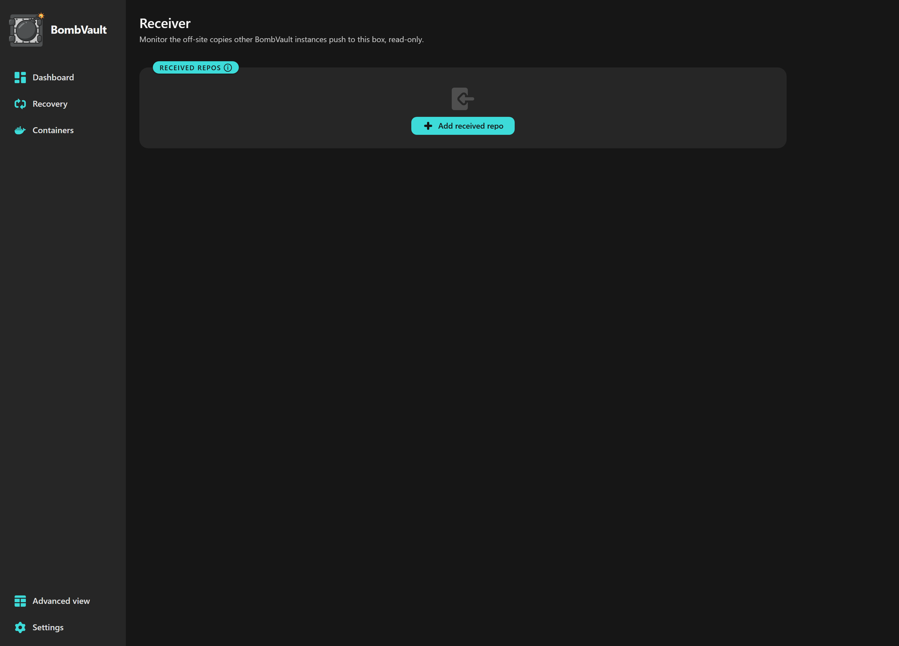

# Off-site och återställning

Lokala säkerhetskopior skyddar dig mot en förlorad container eller en dålig uppdatering. Off-site-replikering och ett testat återställningskit skyddar dig mot hela boxen, ransomware eller en brand. Den här sidan täcker att replikera off-site, att göra den kopian manipuleringssäker, att bevisa att du kan återställa, och att återhämta dig när BombVault självt är borta.

## Off-site-replikering

Behåll den snabba lokala säkerhetskopian och lägg till en eller flera off-site-repliker. Ange ett repo per domän på fliken **Inställningar, Off-site**. BombVault replikerar nya ögonblicksbilder dit med `restic copy` på best-effort-basis, så att en off-site-hicka aldrig misslyckar den lokala säkerhetskopian. Det lokala repot förblir primärt.

- **Flera off-site-mål per domän.** Varje domän (containrar, VM:ar, flash, config och filuppsättningar) kan replikera till flera off-site-mål samtidigt, inte bara ett, så att du kan hålla, till exempel, en rest-server på en väns box och en S3-bucket parallellt. Lägg till extra mål under Inställningar, Off-site, var och en med sitt eget repository, S3-lagringsklass, append-only-flagga, retention och tillväxtbudget. En befintlig enskild off-site-uppsättning förs över orörd som det första målet, och varje mål i en domän replikeras enligt den domänens off-site-schema.
- **Off-site-schema per domän** (redigerat tillsammans med alla andra scheman under Inställningar, Scheman): lämna det tomt för att replikera efter varje lokal säkerhetskopiering, eller sätt en kadens (till exempel `weekly Sun 03:00`) för att skicka off-site mer sällan än du säkerhetskopierar lokalt. En **Replikera nu**-knapp täcker körningar på begäran.
- **Off-site-retention** finns under Inställningar, Off-site så att du kan behålla off-site-kopior längre som ett arkiv. Lämna policyn helt-noll för att aldrig autotrimma off-site-ögonblicksbilder.
- **Bandbreddsgränser** (Inställningar, Off-site) begränsar restics uppladdnings-/nedladdningshastighet så att replikering inte mättar din WAN.
- En **replikeringsindikator** visar vilken domän som replikeras medan det pågår (på dess sida och Översikten). Det är en aktiv indikator, inte en procentstapel, eftersom `restic copy` inte exponerar något maskinläsbart förlopp.

!!! note "Återställ direkt från off-site"
    Varje säkerhetskopieringsläsare har en omkopplare **Lokal / Off-site**, så om ett lokalt repo förloras eller skadas kan du lista och återställa direkt från off-site-repliken. Radering sker per källa: att ta bort en säkerhetskopia påverkar bara den kopia du tittar på.

## Fjärranslutna primära arkiv {#remote-primary-repositories}

En domäns säkerhetskopieringssökväg (Inställningar, Sökvägar och lagring) är inte begränsad till en lokal mapp: rikta den direkt mot ett restic-fjärrarkiv (`s3:...`, `rest:http://värd:8000/arkiv`, `b2:...`, `sftp:användare@värd:/arkiv`, `rclone:fjärr:bucket/sökväg`) så säkerhetskopierar BombVault dit direkt, utan separat lokal kopia och utan replikeringssteg. Det är en verkligt annan form än off-site-replikeringen ovan: där är det lokala arkivet primärt och off-site-arkivet ett arkiv av det efter bästa förmåga; här **är** fjärrarkivet det primära, och det är den enda kopian så länge du inte också ställer in off-site-replikering (eller ett andra fjärrarkiv) för den domänen.

Vart och ett av de fem sökvägsfälten (Containrar, Virtuella maskiner, Flash, Konfiguration, Filer) har en omkopplare **Lokal / Fjärr** alldeles intill:

- **Lokal** visar den vanliga mappbläddraren.
- **Fjärr** byter ut den mot ett enkelt URL-fält, plus en knapp som öppnar samma dialog för anslutningstest och inloggningsuppgifter som off-site-destinationer använder, fast inställd för det här primära arkivet. Därifrån får du:
    - **Ett anslutningstest** mot den verkliga sökvägen, innan du förlitar dig på den.
    - **Bandbreddsgränser** (uppladdning och nedladdning) så att en schemalagd säkerhetskopiering till ett fjärrprimärt arkiv inte mättar din WAN-länk: samma restic-flaggor `--limit-upload` och `--limit-download` som off-site-replikeringen använder, nu tillämpade på själva säkerhetskopieringen.
    - **Append-only-skydd (oföränderlighet)**, verifierat med samma aktiva manipulationstest (en riktig DELETE-sond mot andra sidan) som off-site-destinationer får. Med det påslaget vägrar BombVault att själv gallra arkivet: eftersom ingen separat lokal kopia står bakom, får inloggningsuppgifterna på den här maskinen inte kunna radera säkerhetskopians enda kopia.
    - **Ett larm för tillväxtbudgeten**, hämtat ur samma trend för arkivets storlek som Lagringskortet redan följer.

Inget av detta är obligatoriskt: en handskriven fjärrsökväg utan sparade säkerhetsinställningar säkerhetskopierar precis som förut (obegränsad bandbredd, gallringsbar, inget budgetlarm). Säkerhetsdialogen finns där för när du vill ha samma skydd som en off-site-kopia får, utan att behöva skapa en off-site-destination bara för det.

!!! note "Moln- och REST-uppgifter delas"
    Ett fjärrprimärt arkiv autentiserar med samma S3-/REST-uppgifter som ställts in under Inställningar, Off-site, Molnuppgifter. Det finns ingen separat uppgiftslagring för primära arkiv.

## Oföränderligt (append-only) off-site

Flagga ett off-site-repo append-only så att ransomware, eller en komprometterad värd, inte kan radera eller skriva om dina säkerhetskopior. Den bortre sidan (en `restic/rest-server` som körs i `--append-only`-läge) **upprätthåller** det. BombVault **verifierar** det bara och visar aldrig grönt enbart på ett konfigurationspåstående.

Guiden **guidad off-site-uppsättning** lotsar dig från val av backend (rest-server / rclone / S3) genom ett färdigt-att-klistra-in rest-server-deploy-utdrag, ett anslutningstest, den oföränderliga växeln (som kör manipulationstestet omedelbart) och en retention-strategi, så att append-only off-site är nåbar utan att handredigera konfigurationer.

!!! warning "Oföränderliga repos rensas aldrig från den här boxen"
    Ett oföränderligt off-site rensar avsiktligt aldrig gamla ögonblicksbilder. Sätt ett **tillväxtbudget-alarm** för det så att du varnas innan repo-storleken skenar iväg.

## Manipulationstest

BombVault bevisar regelbundet append-only-garantin genom att faktiskt försöka en radering mot off-site-repot, riktad mot ett obefintligt objekt:

- **Nekad** betyder skyddad.
- **Accepterad** betyder inte skyddad.
- Ett **obestämt** resultat (server onåbar, autentiseringsfel) vänder aldrig det lagrade utslaget.

En verklig skyddad-till-oskyddad-vändning avfyrar ett enda larm.

## DR-övningar

BombVault erbjuder två nivåer av bevis på att dina säkerhetskopior faktiskt går att återställa, inte bara finns.

- **Återställningsverifieringsövningar (lokala).** BombVault kör regelbundet `restic check --read-data-subset` (avgränsad, aldrig en diskfyllande fullständig återställning) och visar en *senast verifierad återställbar*-märkning per domän. Kadensen finns under Inställningar, Scheman; märkningen under Inställningar, Integritet.
- **DR-övningar (off-site).** BombVault återställer ett verkligt mål från off-site-repot till en engångssandlåda, verifierar det fil-för-fil och byte-för-byte, och städar sedan upp. Detta bevisar att du kan återhämta dig från off-site, inte bara att repot svarar.

**Poängkortet för ransomware-skydd** på Översikten rullar upp detta i en grön / gul / röd hållning per domän, med en åldersstämplad checklista (off-site konfigurerat, append-only verifierat, replikering aktuell, återställningsövning godkänd, kryptering på, rensningsstrategi satt). Varje röd rad djuplänkar till åtgärden, och kortet blir grönt endast på verifierade fakta.

## Mottagarpanel (den mottagande sidan)



*Den mottagande sidan, bevakad skrivskyddat, med en integritetskontroll körd på denna maskin.*

Allt ovan är den *sändande* sidan. På boxen som **tar emot** oföränderliga off-site-kopior från en annan BombVault ger mottagarpanelen dig oberoende, skrivskyddad övervakning av de repositorierna på den mottagande hårdvaran, så att ett tyst fel i den bortre änden inte förblir obemärkt.

Slå på **Mottagare**-växeln i Inställningar för att avslöja en **Mottagare**-flik. Den är av som standard; aktivera den endast på en box som faktiskt tar emot oföränderliga off-site-säkerhetskopior. Registrera sedan ett mottaget repository (skrivskyddat, öppnat med den sändande instansens nyckel) för att få:

- **En ögonblicksbildsinventering grupperad per källa**, så att du exakt kan se vilka containrar, VM:ar och filuppsättningar som har landat.
- **Senast mottaget** per källa, så att du vet hur färsk var och en är.
- **En oberoende `restic check`** körd på den mottagande hårdvaran, så att integritet verifieras där datan faktiskt sitter, inte bara på avsändaren.
- **En dödmansknapp:** ett larm när en källa slutar sända inom ett fönster du ställer in.
- **Integritetslarm:** ett larm när en kontroll på den mottagande sidan misslyckas.

Mottagaren är strikt skrivskyddad. Den skriver aldrig till det mottagna repositoriet, så den kan aldrig bryta append-only-garantin som avsändaren förlitar sig på.

## Genomgånget exempel: två Unraid-maskiner, hela vägen

Ovan beskrivs delarna. Här är en komplett uppsättning med riktiga värden, för delar är lättare att sätta ihop när man har sett dem ihopsatta en gång.

Två maskiner: **TOWER** kör containrarna och skickar säkerhetskopiorna, **VAULT** tar emot dem och upprätthåller oföränderligheten. Byt ut mot dina egna namn, adresser och utdelningssökvägar.

**1. Res upp append-only-servern på VAULT.** I BombVault på TOWER, gå till *Inställningar → Extern → guidad installation*, välj **rest-server** och generera receptet. Kopiera fliken **Unraid-mall (XML)**, spara den på VAULT som `/boot/config/plugins/dockerMan/templates-user/my-rest-server.xml`, gå sedan till *Docker → Add Container* och välj **rest-server** i mallistan. Skriv in den visade `htpasswd`-raden i `/mnt/user/appdata/rest-server/.htpasswd` på VAULT innan du startar den. Engångslösenordet visas en gång och sparas aldrig, kopiera det nu.

    Låt `--append-only` stå kvar i OPTIONS-fältet. Det är hela poängen: utan det är VAULT en vanlig utdelning igen.

**2. Peka det externa arkivet dit på TOWER.** Arkivets URL följer mönstret som receptet skriver ut:

    rest:http://VAULT:8000/bombvault-containers/containers

Första segmentet i sökvägen är htpasswd-användaren, det andra är arkivet. Ange den genererade användaren och lösenordet som destinationens REST-uppgifter och kör **anslutningstestet**.

**3. Slå på ”Oföränderlig” på TOWER.** Manipulationstestet körs direkt och måste säga *skyddad*. Vad svaren betyder:

| Resultat | Vad som hände |
| --- | --- |
| **skyddad** | VAULT vägrade raderingen. Det är det enda godkända tillståndet. |
| **INTE skyddad** | VAULT accepterade en radering. `--append-only` saknas eller har tagits bort. |
| **ej avgörande** | Varken eller. Oftast är adressen inte den restic själv använder, eller så har uppgifterna ändrats. Inget registreras och inget larm utlöses. |

**4. Se på VAULT vad som kommer in.** Slå på *Inställningar → Mottagare*, öppna fliken **Mottagare** och registrera arkivet skrivskyddat.

!!! warning "Platsen är en sökväg **inuti** containern, skriven relativt värdmonteringen"
    Ange `user/appdata/rest-server/bombvault-containers/containers`, **inte** `/mnt/user/appdata/…`. BombVault kör i en container där värdens `/mnt` är monterad någon annanstans; en absolut värdsökväg finns inte där. Klistrar du in en sådan talar BombVault nu om vilken relativ sökväg du ska använda i stället.

    **Sändande APP_KEY** är TOWERs nyckel, inte VAULTs. Du hittar den på TOWER under *Inställningar → System*.

**5. Gör det ömsesidigt, om du vill.** Upprepa samma fem steg åt andra hållet: en rest-server på TOWER som tar emot VAULTs kopia. Då upprätthåller varje maskin oföränderligheten åt den andra, och ingen kan radera den andras säkerhetskopior.

## Guidad återställning

En dedikerad **Återställning**-flik lotsar en ny eller ombyggd installation genom katastrofscenariot, på ett ställe:

1. **Återställer BombVaults egna inställningar först**, så att säkerhetskopiesökvägarna, off-site-målen och uppgifterna som resten av flödet behöver kommer förifyllda (tillämpade via en självomstart över Docker-socketen, så att den körande inställningsdatabasen aldrig skrivs över under ett öppet handtag).
2. **Kontrollerar att BombVault kan läsa dina säkerhetskopior** (krypteringsnyckel-fällan direkt).
3. Låter dig **peka mot ditt befintliga repo** (lokalt eller off-site).
4. **Identifierar** containrarna, VM:arna och filuppsättningarna lagrade i det.
5. **Återställer dem alla** (lämnade stoppade, så att du startar dem medvetet), med ditt återställningskit ett klick bort.

!!! tip "Planerad migrering kontra katastrof"
    Guidad återställning återställer BombVaults egna inställningar från en säkerhetskopia. För en *planerad* flytt till en ny box kan du istället ta med din konfiguration direkt med kortet **Exportera och importera inställningar** (en portabel JSON-fil). Se [Konfiguration](configuration.md#portable-settings-export-and-import).

### Återställ från ett annat BombVault-repo

Ett separat kort på fliken **Återställning** öppnar en *annan* BombVault-instans repo (en resurs monterad under `/mnt`, eller en fjärr-URL) med **den instansens `APP_KEY`**, i en engångs, skrivskyddad session. Bläddra bland containrarna, VM:arna och filuppsättningarna som lagras där, välj en ögonblicksbild och återställ den, och det återställda objektet blir en normal lokal container, VM eller filuppsättning. Inget skrivs någonsin till det andra repot, och dina egna säkerhetskopieringsinställningar förblir orörda (sessionen lever i minnet och löper ut av sig själv). Att flytta en container från server A till server B innebär inte längre att peka om dina repo-inställningar och återställa dem efteråt. Live server-till-server-federation är uttryckligen utanför omfånget; detta är en avsiktlig engångshämtning.

## Återställningskit för krypteringsnyckeln

Detta är delen som gör katastrofåterställning möjlig även när det inte finns någon körande BombVault.

Ett klick laddar ner **huvudnyckeln**, det **härledda restic-lösenordet** och de **exakta repo-platserna och kommandona**, så att du kan återställa direkt med restic-CLI på valfri maskin. En påminnelse på Översikten tjatar tills du har förvarat det.

!!! danger "Förvara återställningskitet bort från servern"
    Kitet innehåller hemligheten som dekrypterar dina säkerhetskopior. Förvara det på en säker plats åtskild från servern (en lösenordshanterare, en utskriven kopia i ett kassaskåp). Om du förlorar både BombVault och `APP_KEY` utan något återställningskit kan dina krypterade säkerhetskopior inte återställas.

### När paketet inte finns till hands

Lösenordet lagras ingenstans, det **beräknas** ur `APP_KEY`. Med nyckeln och ett skal kan du alltså återskapa det själv:

```sh
printf 'bombvault:restic-repo' \
  | openssl dgst -sha256 -mac HMAC -macopt hexkey:$APP_KEY -r \
  | cut -d' ' -f1
```

Det är HMAC-SHA256 över den fasta strängen `bombvault:restic-repo`, med de råa byten i den hexadecimala `APP_KEY` som nyckel, utskrivet som 64 gemena hexadecimala tecken. Samma värde står i paketet som det härledda restic-lösenordet; det här är för dagen då paketet ligger någon annanstans än du.

!!! warning "För ett mottaget arkiv, använd den SÄNDANDE instansens nyckel"
    Ett arkiv som kommit hit via off-site-replikering skapades av maskinen som skickade det, med **dess** `APP_KEY`. Att härleda ur den mottagande maskinens nyckel ger ett lösenord som restic avvisar, vilket ser ut precis som ett trasigt arkiv utan att vara det. Det är den vanliga anledningen till att `restic check` på ett mottaget arkiv frågar efter lösenordet gång på gång.

Eftersom återställningsdefinitioner ligger **inuti** varje repo (`<repo>/def`, `<repo>/vm-def`) är en kopierad repo-mapp helt självständig, så kitet plus repot är allt en bare-metal-återställning behöver.
